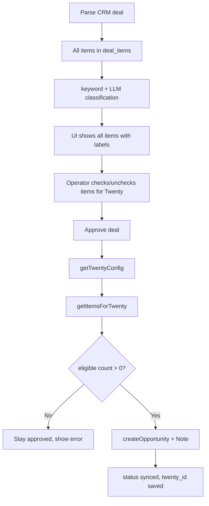

# Twenty CRM Sync — Design Spec

**Date:** 2026-06-05  
**Status:** Approved

## Problem

1. Deals may not sync to Twenty because credentials are configured in both `.env` and UI settings, but sync code reads only environment variables.
2. Sync errors are invisible in the UI (only parse logs exist).
3. Users need all items visible in the parser, but only branding-related items sent to Twenty.
4. Users need a way to manually include items that keywords/LLM missed.

## Goals

- Reliable sync with unified Twenty credentials (env + settings fallback).
- Parser UI shows **all** deal items.
- Twenty receives **only eligible** items (automatic + manual).
- Clear diagnostics when sync fails or has nothing to send.
- Operators can **manually check/uncheck specific items** to control exactly what goes to Twenty.

## Non-Goals

- Updating existing Twenty opportunities on re-parse (v1 stays create-only; `twenty_id` prevents duplicates).
- Syncing non-branding deal metadata beyond Opportunity + Note.

---

## Architecture



---

## Twenty Credentials

### Source priority

1. `TWENTY_API_URL` / `TWENTY_API_TOKEN` from environment (if non-empty)
2. Else `twenty_api_url` / `twenty_api_token` from SQLite `settings`
3. Else sync unavailable → error `Twenty CRM not configured`

### Helper

`getTwentyConfig()` returns `{ apiUrl, apiToken, source: 'env' | 'settings' | null }`.

Settings UI shows hint: *«Если TWENTY_* заданы в .env / docker-compose, они имеют приоритет»*.

---

## Item Eligibility for Twenty

### Automatic (default)

| `classification` | Auto sync? |
|--------------------|------------|
| `keyword_match`    | Yes        |
| `llm_confirmed`    | Yes        |
| `llm_rejected`     | No         |
| `unclassified`     | No         |

### Manual override — `sync_override` column on `deal_items`

New nullable column: `sync_override TEXT` with values:

| Value     | Meaning                                      |
|-----------|----------------------------------------------|
| `null`    | Use automatic rules from `classification`    |
| `include` | Force into Twenty (even if unclassified / llm_rejected) |
| `exclude` | Force out of Twenty (even if keyword_match / llm_confirmed) |

### `getItemsForTwenty(dealId)` logic

```
for each item:
  if sync_override == 'include'  → eligible
  if sync_override == 'exclude'  → skip
  if classification in (keyword_match, llm_confirmed) → eligible
  else → skip
```

Single source of truth used for:
- Opportunity `amount` (sum of eligible item prices × quantity logic as today)
- Note body (eligible items only)
- UI badge «→ Twenty: N из M»

---

## Manual item selection in UI (primary workflow)

When a deal row is expanded, the items table gets a column **«В Twenty»** with a **checkbox on every row**.

### Checkbox behaviour

| User action | `sync_override` saved | Result |
|-------------|----------------------|--------|
| Checks box   | `include` | Item goes to Twenty (even if AI/keywords missed it) |
| Unchecks box | `exclude` | Item stays out of Twenty (even if keywords matched) |
| «Сбросить к авто» on deal | `null` on all items | Checkboxes reflect classification rules again |

### Initial checkbox state (when `sync_override` is null)

Derived from classification — no manual action yet:

- `keyword_match` / `llm_confirmed` → ☑ checked
- `llm_rejected` / `unclassified` → ☐ unchecked

After the user touches a checkbox, that row gets an explicit `include` or `exclude` override and keeps it until reset or re-parse.

### Row display

Each item row shows:

1. **Checkbox «В Twenty»** — main control for manual selection
2. **Classification label** (as today): Ключевое слово / LLM: да / LLM: нет / Не определено
3. **Small hint** when override differs from auto: «вручную» (manual) vs «авто» (auto)

### Deal-level actions (above items table)

- **«Сбросить к авто»** — clears all `sync_override`, checkboxes follow classification
- Counter **«→ Twenty: N из M»** — updates live as checkboxes change

### API

`PATCH /api/deals/:dealId/items/:itemId/sync-override`  
Body: `{ syncOverride: 'include' | 'exclude' | null }`

Called immediately on checkbox change (optimistic UI).

Optional bulk: `POST /api/deals/:dealId/items/sync-override-bulk`  
Body: `{ itemIds: [1, 3], syncOverride: 'include' }` — for future «выбрать несколько» if needed; v1 uses per-row checkbox only.

### Example

Deal has 5 items. Operator manually checks «Печать наклеек» and unchecks «Баннер 3×6»:

| Item               | classification | ☑ В Twenty | sync_override | → Twenty? |
|--------------------|----------------|------------|---------------|-----------|
| Баннер 3×6         | keyword_match  | ☐          | **exclude**   | No (manual) |
| Монтаж конструкций | unclassified   | ☐          | null          | No        |
| Печать наклеек     | llm_rejected   | ☑          | **include**   | Yes (manual) |
| Кейтеринг          | llm_rejected   | ☐          | null          | No        |
| Ролл-ап            | unclassified   | ☐          | null          | No        |

Operator sees «→ Twenty: 1 из 5». Only «Печать наклеек» goes to Twenty — exactly what was checked.

### Approve flow

1. Expand deal → review all items
2. Check/uncheck specific positions
3. Confirm «→ Twenty: N из M» > 0
4. Click approve → sync uses only checked items via `getItemsForTwenty`

---

## Sync Gate

Before `createOpportunity`:

- If `getItemsForTwenty(dealId).length === 0`:
  - Do **not** call Twenty API
  - Keep `approval_status = 'approved'` (not `synced`)
  - Return error: `Нет позиций для переноса в Twenty`
  - Store `twenty_error` on deal (new column or reuse error in sync log)

- If `deal.twenty_id` already set → return `{ action: 'already_synced' }`

---

## Sync Execution (`syncDealToTwenty`)

1. `getTwentyConfig()` — fail if not configured
2. Load deal; skip if `twenty_id` present
3. `items = getItemsForTwenty(dealId)` — fail if empty
4. `findOrCreateCompany(company_code)`
5. `findOrCreatePerson(manager_name, companyTwentyId)`
6. GraphQL `createOpportunity` with:
   - `name` = deal title
   - `amount` = sum eligible item prices
   - `companyId`, `pointOfContactId` when available
7. GraphQL `createNote` with eligible items text
8. Update deal: `twenty_id`, `synced_at`, `approval_status = 'synced'`, clear `twenty_error`
9. Write `sync_runs` log entry

### GraphQL hardening

- Use variables only (no string interpolation in queries)
- Check `response.data.errors` and surface first error message
- Configurable `opportunity_stage` in settings (default `NEW`)

---

## Diagnostics

### `GET /api/deals/:id/sync-preview`

Response (no writes):

```json
{
  "configured": true,
  "configSource": "env",
  "eligibleCount": 2,
  "totalCount": 5,
  "eligibleAmount": 45000,
  "eligibleItems": [{ "id": 1, "name": "Баннер 3×6", "reason": "keyword_match" }],
  "alreadySynced": false
}
```

`reason`: `keyword_match` | `llm_confirmed` | `manual_include` | (`manual_exclude` excluded from list)

### Sync logs

New table `sync_runs`:

| Column      | Type    |
|-------------|---------|
| id          | INTEGER |
| deal_id     | INTEGER |
| status      | success / failed |
| twenty_id   | TEXT    |
| error       | TEXT    |
| created_at  | TEXT    |

Show on Logs page (tab or section) and last error on deal row when `approval_status = 'approved'` with failed sync.

---

## UI Changes Summary

| Location | Change |
|----------|--------|
| DealItems | All items + checkbox «В Twenty» per row; «Сбросить к авто»; live N/M counter |
| DealRow   | Badge «→ Twenty: N/M»; show `twenty_error` if present |
| Settings  | Hint about env priority for Twenty credentials |
| Logs      | Sync run history |

Parser continues to store and display **all** parsed items. Only the sync layer filters.

---

## Database Migration

```sql
ALTER TABLE deal_items ADD COLUMN sync_override TEXT; -- null | 'include' | 'exclude'
ALTER TABLE deals ADD COLUMN twenty_error TEXT;

CREATE TABLE IF NOT EXISTS sync_runs (...);
```

---

## Testing (CI)

- Unit: `getItemsForTwenty` with all classification + override combinations
- Unit: `getTwentyConfig` env vs settings priority
- Unit: sync gate rejects zero eligible items
- No live Twenty API calls in CI

---

## Implementation Order

1. `getTwentyConfig` + fix sync to use it
2. `sync_override` migration + `getItemsForTwenty`
3. GraphQL error handling
4. Sync gate + `sync_runs` logging
5. UI checkboxes + sync-preview + badges
6. Settings hint
