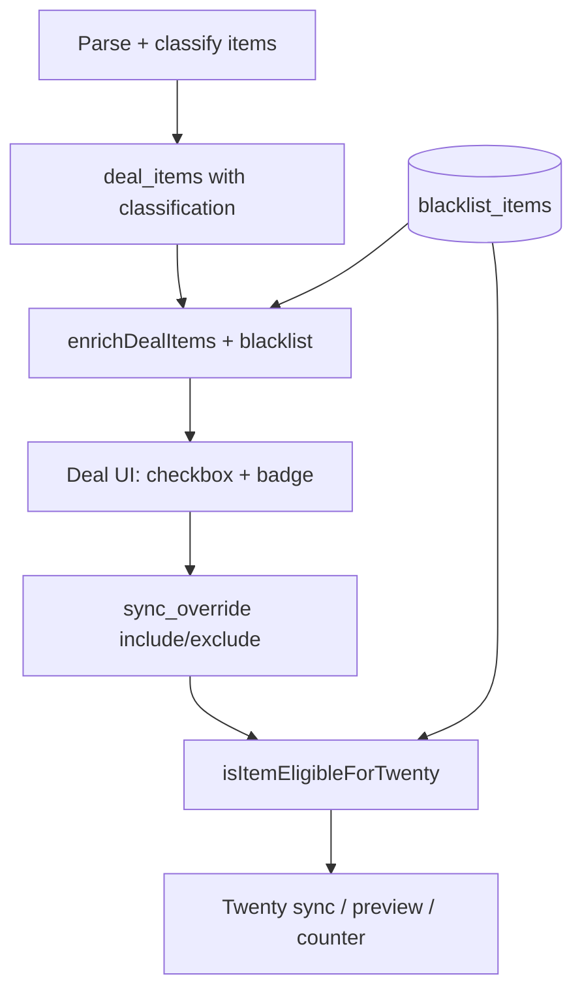

# Item Blacklist — Design Spec

**Date:** 2026-06-08  
**Status:** Draft (pending user review)

## Problem

Keywords like «стойка» correctly match many branding items, but some specific products (e.g. «Стойка указатель напольная А4») should never be auto-sent to Twenty. Today the only per-deal escape is unchecking «В Twenty» (`sync_override = 'exclude'`) in every deal individually — tedious and lost on re-parse for new `deal_items` without override.

Operators need a **global, persistent blacklist** with flexible matching and a quick way to add entries while reviewing deals.

## Goals

- Globally exclude specific item names (or name fragments) from **automatic** Twenty eligibility.
- Support two match modes: **exact** and **substring**.
- Manual `include` on a deal row **overrides** the blacklist for that deal only.
- Effect is **immediate** on all loaded deals and **persists** across re-parses.
- Manage blacklist in Settings; add from deal item review with one click (default: exact match).
- Classification during parse (`keyword_match`, etc.) stays unchanged — blacklist only affects Twenty eligibility.

## Non-Goals

- Blacklist affecting keyword/LLM classification during parsing.
- Bulk blacklist import/export (v1).
- Auto-suggesting substring patterns when adding from a deal (v1 uses exact full name only).

---

## Architecture



Blacklist is evaluated at **read time** and **sync time**, not stored per `deal_item`. No mass UPDATE of `sync_override` when adding/removing blacklist entries.

---

## Data Model

### Table `blacklist_items`

```sql
CREATE TABLE IF NOT EXISTS blacklist_items (
  id INTEGER PRIMARY KEY AUTOINCREMENT,
  pattern TEXT NOT NULL,
  match_type TEXT NOT NULL CHECK (match_type IN ('exact', 'substring')),
  source_name TEXT,
  created_at TEXT NOT NULL DEFAULT (datetime('now')),
  UNIQUE (pattern, match_type)
);
```

- `pattern` — stored **normalized** (`trim` + lowercase + ё→е) so DB `UNIQUE (pattern, match_type)` prevents case/ё duplicates.
- `match_type` — `exact` or `substring`.
- `source_name` — optional original item name when added from a deal (shown in Settings as hint if different from normalized pattern).

### Normalization

Same as keyword classifier (`classifier.js`):

```js
text.toLowerCase().replace(/ё/g, 'е').trim()
```

### Matching rules

| `match_type` | Rule |
|--------------|------|
| `exact` | `normalize(itemName) === normalize(pattern)` |
| `substring` | `normalize(itemName).includes(normalize(pattern))` |

If multiple rules match, any hit → blacklisted. `blacklistMatch` in API returns the **first** matching entry (order: `created_at ASC`).

---

## Eligibility Logic

Update `isItemEligibleForTwenty(item, blacklist)` in `twenty-items.js`:

```
1. sync_override === 'include'  → eligible   (overrides blacklist)
2. sync_override === 'exclude'  → not eligible
3. isBlacklisted(item.name, blacklist) → not eligible
4. classification ∈ {keyword_match, llm_confirmed} → eligible
5. else → not eligible
```

`getItemEligibleReason` — when blacklisted and not manually included, return `null` (not eligible). No new reason code in v1.

### `enrichDealItems(items, blacklist)`

Add fields:

| Field | Type | Description |
|-------|------|-------------|
| `blacklisted` | boolean | Name matches any blacklist rule |
| `blacklistMatch` | object \| null | `{ id, pattern, matchType }` of first match |

Existing fields unchanged: `eligibleForTwenty`, `syncMode`, `eligibleReason`.

### Deal list `branding_count`

`TWENTY_ELIGIBLE_COUNT_SQL` cannot express substring blacklist. **v1 approach:** load blacklist once per `GET /deals` request; for each deal, load items (or count in JS from a lightweight query) and compute eligible count via `enrichDealItems`. If performance becomes an issue, optimize later with cached counts.

`buildSyncPreview` and `syncDealToTwenty` must pass blacklist into `getItemsForTwenty`.

---

## Backend API

New router: `backend/src/routes/blacklist.js`, mounted at `/api/blacklist`.

| Method | Path | Body / params | Response |
|--------|------|---------------|----------|
| `GET` | `/api/blacklist` | — | `{ items: BlacklistEntry[] }` |
| `POST` | `/api/blacklist` | `{ pattern, matchType, sourceName? }` | `{ item: BlacklistEntry }` |
| `DELETE` | `/api/blacklist/:id` | — | `{ success: true }` |

Shortcut from deal review:

| Method | Path | Description |
|--------|------|-------------|
| `POST` | `/api/deals/:dealId/items/:itemId/blacklist` | Reads item `name`; creates `exact` entry with `pattern = name`, `sourceName = name` |

### Validation & errors

| Case | HTTP |
|------|------|
| Empty `pattern` after trim | 400 |
| Invalid `matchType` | 400 |
| Duplicate (normalized pattern + type) | 409 |
| Blacklist id not found on DELETE | 404 |
| Deal/item not found on shortcut POST | 404 |

---

## Frontend UI

### Settings — section «Блеклист»

Below «Ключевые слова брендинга»:

- List: each row shows `pattern`, badge (`точное` / `фрагмент`), delete `×`.
- Add form: text input + radio/select (`exact` / `substring`) + «Добавить».
- Hint: *«Позиции в блеклисте не попадают в Twenty автоматически. Ручная галочка в сделке перебивает блеклист.»*

React Query hooks: `useBlacklist`, `useAddBlacklistItem`, `useRemoveBlacklistItem` (mirror keywords pattern in `api.js`).

### Deal items — `DealItems.jsx`

Per row:

| State | Checkbox | Label under checkbox |
|-------|----------|----------------------|
| Not blacklisted, auto eligible | ☑ | «авто» |
| Not blacklisted, auto ineligible | ☐ | «авто» |
| Blacklisted, no override | ☐ | **«блеклист»** |
| Blacklisted, `include` | ☑ | «вручную» |
| Any, `exclude` | ☐ | «вручную» |

Actions:

- **«В блеклист»** button when `!item.blacklisted` — calls shortcut POST; on success invalidate deals + blacklist queries.
- **«блеклист»** badge (no button) when already matched.

Counter «→ Twenty: N из M» uses `eligibleForTwenty` (blacklist-aware).

---

## Error Handling

- Failed blacklist add from UI: toast or inline error (409 → «Уже в блеклисте»).
- Sync with all items blacklisted/manual excluded: existing «no eligible items» error path unchanged.
- Empty blacklist: zero overhead — `isBlacklisted` returns false immediately.

---

## Testing

### `backend/tests/blacklist.test.js`

- `exact` match with case and ё/е normalization.
- `substring` match.
- No false positive on partial exact (exact «стойка А4» does not match «стойка А40»).
- `isBlacklisted` with multiple rules.

### `backend/tests/twenty-items.test.js` (extend)

- `keyword_match` + blacklisted → not eligible.
- `keyword_match` + blacklisted + `sync_override: 'include'` → eligible.
- `sync_override: 'exclude'` still wins over include path... (exclude before blacklist check — unchanged).

### Manual test plan

1. Add keyword «стойка»; parse deal with two стойки including «Стойка указатель напольная А4».
2. Blacklist exact name from deal row → both deals list and expanded row show ☐ + «блеклист» for that item; other стойки stay ☑.
3. Manually check blacklisted row → sync preview includes it.
4. Remove from Settings blacklist → item auto-eligible again.
5. Add substring «указатель напольная» in Settings → blocks all matching names.
6. Re-parse deal → blacklist still applies; manual overrides preserved.

---

## File Touch List

| Area | Files |
|------|-------|
| DB | `schema.sql`, `migrate.js` |
| Services | `blacklist.js` (new), `twenty-items.js`, `twenty-sync.js` |
| Routes | `blacklist.js` (new), `deals.js`, `index.js` |
| Frontend | `api.js`, `Settings.jsx`, `DealItems.jsx` |
| Tests | `blacklist.test.js` (new), `twenty-items.test.js` |

---

## Decisions Log

| Decision | Choice | Rationale |
|----------|--------|-----------|
| Storage | Dedicated table | CRUD, metadata, no JSON blob limits |
| Match modes | exact + substring | User choice C |
| vs manual include | include wins | User choice B |
| Retroactive scope | All deals + re-parse | User choice C |
| Add from deal default | exact full name | User choice A |
| vs classification | Eligibility only | Keeps keyword stats honest; simpler |
