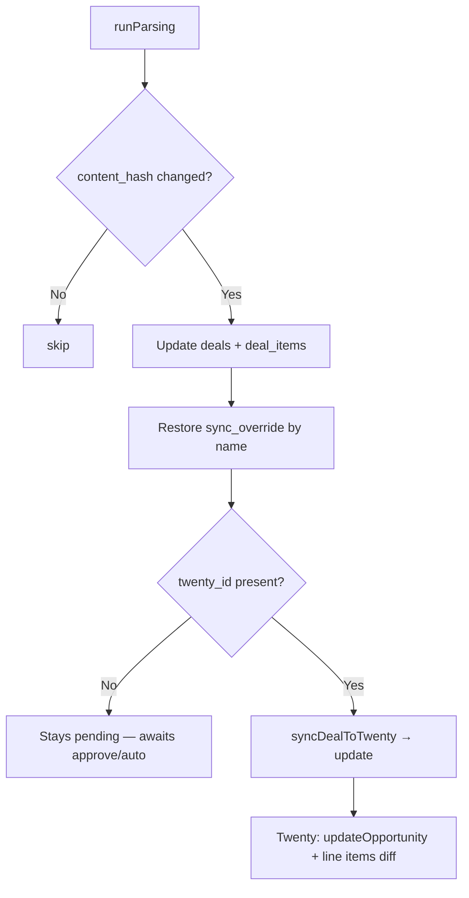

# Deal Re-sync to Twenty CRM — Design Spec

**Date:** 2026-06-09  
**Status:** Approved

## Problem

The parser detects deal changes via `content_hash` and updates local SQLite data, but sync to Twenty CRM is create-only. When `deal.twenty_id` is set, `syncDealToTwenty` returns `already_synced` without pushing changes. This blocks autonomous operation: scheduled parsing updates local data while Twenty stays stale.

## Goals

- After parsing, automatically push changes to Twenty for deals that are already synced (`twenty_id` present).
- Update full Opportunity metadata and line items (add, update, remove).
- Preserve manual `sync_override` per item name across re-parses.
- When zero eligible items remain, update Opportunity with amount = 0 and clear line items in Twenty (do not delete Opportunity).
- Auto re-sync works regardless of `approval_mode` (manual / semi / auto).
- No re-approval required for already-synced deals.

## Non-Goals

- Deleting Opportunity in Twenty when eligible items drop to zero.
- Changing Opportunity `stage` on update (keep current stage in Twenty).
- Conflict resolution when someone manually edited Twenty outside the parser.
- Unlocking item checkboxes for synced deals in UI (v1: overrides change only via re-parse + name matching).

---

## Decisions Summary

| Question | Decision |
|----------|----------|
| Approval on change | Fully automatic, no re-approval |
| What to update | Everything: metadata + line items diff |
| Manual overrides on re-parse | Preserve `sync_override` (and `twenty_id`) by item `name` |
| Zero eligible items | Update Opportunity (amount = 0), delete all line items in Twenty |
| `approval_mode` for updates | Always auto-update if `twenty_id` exists |

---

## Architecture

**Approach:** Unified `syncDealToTwenty` with create/update branch (recommended over separate queue or event-driven design).



**Trigger:** At end of `runParsing`, call sync for each deal ID collected during the run that was updated and has `twenty_id`. Applies to scheduler and manual parse runs alike.

**Deal status:** Remains `synced` after successful update (never returns to `pending`).

---

## Parser Changes

When updating an existing deal (`content_hash` differs):

### 1. Preserve overrides before item replacement

Before `DELETE FROM deal_items`:

```js
const overrideMap = {};
for (const item of existingItems) {
  if (item.sync_override || item.twenty_id) {
    overrideMap[item.name] = {
      sync_override: item.sync_override,
      twenty_id: item.twenty_id,
    };
  }
}
```

### 2. Restore after insert

After inserting new classified items, for each row where `overrideMap[item.name]` exists:

```sql
UPDATE deal_items SET sync_override = ?, twenty_id = ? WHERE id = ?
```

### 3. Collect deals for re-sync

During the update branch, if the deal has `twenty_id`:

```js
dealsToResync.push(existing.id);
```

### 4. Post-parse sync phase

At end of `runParsing` (before returning stats):

```js
for (const dealId of dealsToResync) {
  try {
    await syncDealToTwenty(dealId);
  } catch (err) {
    console.error(`Re-sync failed for deal ${dealId}:`, err.message);
  }
}
```

Remove duplicate auto-sync from scheduler for updated synced deals — `runParsing` owns re-sync. Scheduler continues to auto-sync **new** `pending` deals only.

---

## Sync Logic (`syncDealToTwenty`)

### Branch

| Condition | Action |
|-----------|--------|
| No `twenty_id` | **create** (existing behaviour) |
| `twenty_id` present | **update** |

Early return `already_synced` is removed for the update path.

### Shared helpers

Extract from current create flow:

- `buildOpportunityInput(deal, items)` — shared field mapping
- `syncLineItems(apiUrl, apiToken, oppId, items, db)` — create/update line items, save `twenty_id` on local items

### Update Opportunity

GraphQL `updateOpportunity(id: $id, data: $input)` with fields:

- `name`, `closeDate`, `amount` (sum of eligible item prices)
- `companyId`, `pointOfContactId` (via `findOrCreateCompany` / `findOrCreatePerson`)
- `tonyLink`, `bitrixLink`
- `arrivalTime`, `readyTime`, `workTime`, `dismantleTime`

**Not updated:** `stage` (leave as-is in Twenty).

### Line items diff (by name within Opportunity)

1. Query all `dealLineItems` for `opportunityId = twenty_id`.
2. Build set of eligible item names from `getItemsForTwenty`.
3. For each eligible item:
   - Match by `name` + `opportunityId` → `updateDealLineItem`
   - No match → `createDealLineItem` (reuse `findOrCreateWarehouseItem`)
4. For each Twenty line item not in eligible names → `deleteDealLineItem`.
5. Update local `deal_items.twenty_id` for matched/created rows.

### Zero eligible items

1. `updateOpportunity` with `amount: { amountMicros: 0, currencyCode: 'RUB' }` and metadata fields.
2. Delete all line items for the Opportunity in Twenty.
3. Log `sync_runs` with `action: updated_empty`, `status: success`.
4. Deal stays `synced`; clear `twenty_error`.

### Post-success deal update

```sql
UPDATE deals SET
  synced_at = datetime('now'),
  twenty_error = NULL
WHERE id = ?
```

`approval_status` unchanged (`synced`).

---

## New GraphQL Operations

| Operation | Purpose |
|-----------|---------|
| `updateOpportunity` | Push metadata changes |
| `deleteDealLineItem` | Remove line items no longer eligible or all when empty |
| Query `dealLineItems(filter: { opportunityId })` | List existing line items for diff |

Reuse existing: `updateDealLineItem`, `createDealLineItem`, warehouse item helpers.

---

## Diagnostics

### `sync_runs` extension

Add column:

```sql
ALTER TABLE sync_runs ADD COLUMN action TEXT; -- 'created' | 'updated' | 'updated_empty'
```

| action | Meaning |
|--------|---------|
| `created` | New Opportunity created |
| `updated` | Existing Opportunity and/or line items updated |
| `updated_empty` | Opportunity zeroed, line items cleared |

### Errors

On update failure:

- Set `deals.twenty_error` with message
- Log `sync_runs` with `status: failed`, `action: updated`
- Deal remains `synced`; Twenty may be partially stale until next successful parse or manual retry

### Optional: manual re-sync button (v1)

`POST /api/deals/:id/resync` — calls `syncDealToTwenty` for deals with `twenty_id`. Useful for recovery after errors. Not required for autonomous loop but recommended.

---

## UI Changes

| Location | Change |
|----------|--------|
| DealRow | Show `synced_at` or «обновлено» hint when `updated_at > synced_at` was resolved by successful re-sync |
| Logs | Show `action` column in sync runs (created / updated / updated_empty) |
| DealRow | Show `twenty_error` on synced deals when re-sync fails (existing behaviour) |

Synced deals: item checkboxes remain read-only in v1.

---

## Database Migration

```sql
ALTER TABLE sync_runs ADD COLUMN action TEXT;
```

No other schema changes required.

---

## Testing (CI)

### Unit: override preservation

- Re-parse with same item names → `sync_override` and `twenty_id` restored
- New item name → no override
- Renamed item in CRM → treated as delete + create (override not carried)

### Unit: `syncDealToTwenty` branch

- No `twenty_id` → create path
- With `twenty_id` → update path (mock GraphQL)

### Unit: line items diff

- Add item → create called
- Changed price → update called
- Removed item → delete called
- Zero eligible → amount 0, all line items deleted

### Unit: post-parse collection

- Updated deal without `twenty_id` → not in `dealsToResync`
- Updated deal with `twenty_id` → in `dealsToResync`

No live Twenty API calls in CI.

---

## Implementation Order

1. Extract `buildOpportunityInput` + line item sync helpers from create flow
2. Implement `updateDealInTwenty` branch (updateOpportunity, line items diff, delete)
3. Parser: override preservation + `dealsToResync` collection + post-parse sync
4. `sync_runs.action` migration + logging
5. UI: sync log action column, optional resync button
6. Tests

---

## Relation to Prior Specs

Supersedes non-goal in [2026-06-05-twenty-sync-design.md](./2026-06-05-twenty-sync-design.md):

> Updating existing Twenty opportunities on re-parse (v1 stays create-only)

Re-sync is now in scope as v2 of Twenty sync.
