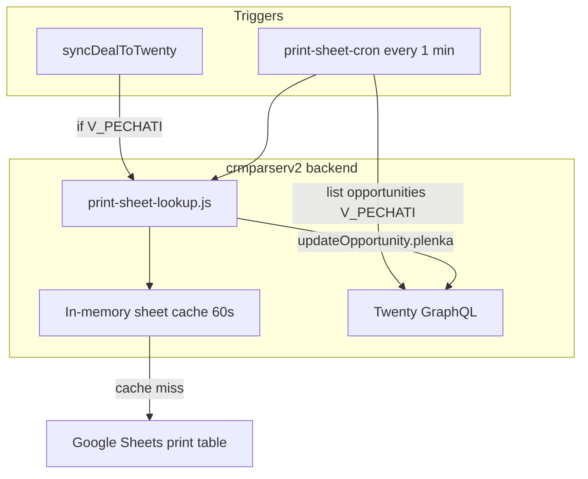

# Print Sheet → Opportunity «Плёнка» — Design Spec

**Date:** 2026-06-15  
**Status:** Approved

## Problem

Previously, a Google Apps Script linked the branding deals table to a print spreadsheet. When a deal status changed to printing («печ…»), the script matched the order name against the print sheet, collected film/banner numbers grouped by type, and wrote a summary like:

`Бронь 162460 | Плёнка: ростовая фигура - 6 | плашки - 7 | …`

The team moved deal management to Twenty CRM. They need the same lookup automated: populate a Rich Text field on Opportunity with film/banner numbers from the print Google Sheet.

## Goals

- Create a **Rich Text** field `plenka` (label «Плёнка») on Opportunity in Twenty CRM.
- When the normalized Opportunity `name` matches column C («Название заказа») in the print sheet, fill `plenka` with one line per film number:
  ```
  ростовая фигура - 6
  плашки - 7
  плашки - 8
  ```
- Refresh triggers:
  1. After `syncDealToTwenty` if the opportunity is in stage `V_PECHATI` («В печати»).
  2. Cron **every 1 minute** for all opportunities in stage `V_PECHATI` (queried from Twenty API, not local SQLite).
- Sheet tab selection: auto-search **three** monthly tabs — event month (`closeDate`), previous month relative to `closeDate`, and current calendar month.
- If no matches: set `Плёнка не найдена`.
- Field is overwritten on each refresh (not appended).

## Non-Goals

- Manual override field for sheet tab selection.
- Storing print sheet rows as a separate Twenty object.
- Twenty workflows or CODE steps for this logic.
- Including «Бронь … | Плёнка:» prefix in the output.
- Changing opportunity stage from the parser.

---

## Decisions Summary

| Question | Decision |
|----------|----------|
| Where to implement | **crmparserv2** backend (extend existing Twenty GraphQL integration) |
| When to refresh | On sync (if `V_PECHATI`) + cron every **1 minute** |
| Sheet tabs | Event month + previous month + current month (deduplicated) |
| Output format | `тип - номер`, **one line per film number** |
| Empty type column | Use «без названия» |
| No matches | `Плёнка не найдена` |
| Google Sheets access | Service account via Google Sheets API |

---

## Architecture



**Print sheet reference:**
- Spreadsheet ID: `12rGgW0vucmm4eXy4yrtQLRLNcqNpPVznpNdA-c1HuP0`
- Monthly tabs named like `Июнь 2026` (Russian month name + year)
- Columns: A = film number, C = order name, E = type («Что брендируется»)

---

## Components

### 1. `print-sheet-normalize.js`

Port of Apps Script `normalize`:

```js
str.toLowerCase()
  .replace(/\s+/g, ' ')
  .replace(/[^\wа-яё0-9 ]/gi, '')
  .trim()
```

### 2. `print-sheet-tabs.js`

Given a reference date (opportunity `closeDate` or `new Date()`):

- Build tab name `{RussianMonth} {YYYY}` for: event month, previous month, current month.
- Deduplicate tab names (e.g. event and current both «Июнь 2026» → one fetch).

Russian month labels: Январь … Декабрь.

### 3. `print-sheet-lookup.js`

- `fetchPrintSheetRows(tabNames)` — Google Sheets API `spreadsheets.values.batchGet`, skip missing tabs.
- `lookupFilmsForOrder(orderName, closeDate)` — normalize, scan rows from all tabs, collect `{ type, film }` pairs, dedupe by `type|film`.
- `formatPlenkaText(matches)` — one line per match: `${type} - ${film}`; empty → `Плёнка не найдена`.
- In-memory cache keyed by tab set, TTL **60 seconds** (shared across opportunities in one cron tick).

### 4. `print-sheet-twenty.js`

- `listOpportunitiesInPrintStage(gql)` — GraphQL `opportunities(filter: { stage: { eq: "V_PECHATI" } })` with `id`, `name`, `closeDate`, `plenka`.
- `updateOpportunityPlenka(gql, id, text)` — `updateOpportunity` with `plenka` field.
- Skip update if new text equals current `plenka` (reduce API calls).

### 5. `print-sheet-cron.js`

- Cron expression: `* * * * *` (every minute), timezone `Europe/Moscow` (same as parser scheduler).
- Guard: skip if `PRINT_SHEET_ID` or Google credentials not configured.
- Flow: list `V_PECHATI` opportunities → for each, `lookupFilmsForOrder` → update if changed.

### 6. Hook in `twenty-sync.js`

After successful create/update, fetch opportunity stage from Twenty (or from response). If `V_PECHATI`, call `refreshPlenkaForOpportunity(oppId, name, closeDate)`.

### 7. Twenty metadata (one-time setup)

Create field via MCP `create_field_metadata`:

| Property | Value |
|----------|-------|
| object | `opportunity` |
| name | `plenka` |
| label | `Плёнка` |
| type | `RICH_TEXT` |
| description | Номера плёнки/баннера из таблицы печати |

### 8. Configuration

`.env` / `config.js`:

| Variable | Description |
|----------|-------------|
| `PRINT_SHEET_ID` | Google Spreadsheet ID |
| `GOOGLE_SERVICE_ACCOUNT_EMAIL` | Service account email |
| `GOOGLE_SERVICE_ACCOUNT_PRIVATE_KEY` | PEM private key (escaped newlines) |
| `PRINT_SHEET_CACHE_TTL_MS` | Default `60000` |

Service account must have **Viewer** access to the print spreadsheet.

---

## Matching Logic

Identical to legacy Apps Script:

1. `orderKey = normalize(opportunity.name)`
2. For each row in fetched tabs (skip header row):
   - `printKey = normalize(row[C])`
   - If `printKey === orderKey` and `row[A]` is non-empty:
     - `type = trim(row[E])` or `без названия`
     - Add `{ type, film: row[A] }` if not duplicate

Order of lines: order encountered in sheet (tabs processed in tab-name order, rows top-to-bottom).

---

## Error Handling

| Situation | Behavior |
|-----------|----------|
| No matches | Write `Плёнка не найдена` |
| Google API error | Log error; do **not** overwrite existing `plenka` |
| Tab not found | Skip tab; continue with others |
| Twenty rate limit | Use existing `twenty-rate-limit.js` retry |
| Credentials missing | Cron no-ops; log once at startup |
| `plenka` unchanged | Skip `updateOpportunity` |

---

## Testing

- **Unit:** `normalize`, tab name builder (edge: Jan 1 → Dec previous year), `formatPlenkaText`, dedupe logic.
- **Unit:** `lookupFilmsForOrder` with mocked Sheets API response.
- **Integration:** mock Twenty list + update; verify cron skips unchanged text.

---

## Dependencies

Add `googleapis` npm package to `backend/package.json` for Sheets API v4.

---

## Security

- Service account credentials only in environment variables (never committed).
- Print sheet is read-only from the parser's perspective.
