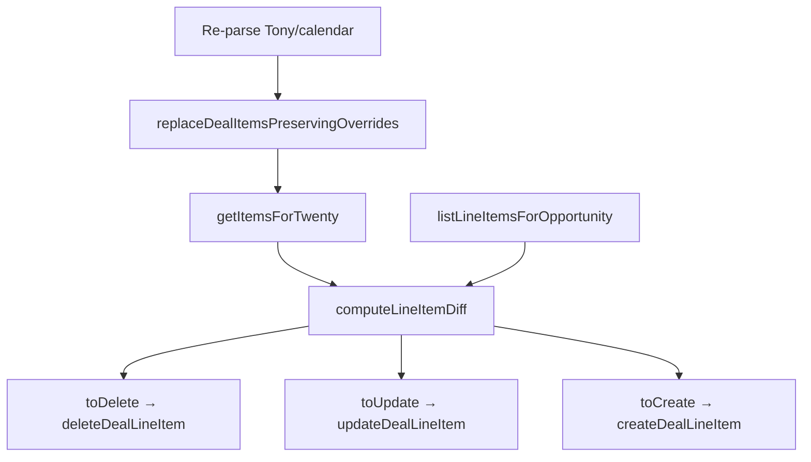

# Защита позиций Twenty от удаления при re-parse — Design Spec

**Дата:** 2026-06-27  
**Статус:** Approved (design); pending implementation  
**Связанные спеки:** `2026-06-09-deal-resync-design.md`, `2026-06-20-twenty-line-items-design.md`, `2026-06-27-restoration-items-design.md`

## Проблема

При повторном парсинге Tony/календаря позиция может исчезнуть из источника (переименование, отмена, ошибка CRM). Синк с Twenty сравнивает **eligible**-позиции из локальной БД с line items в CRM **по имени** и удаляет всё лишнее:

```js
const toDelete = existingLineItems
  .filter((li) => !eligibleNames.has(li.name))
  .map((li) => li.id);
```

Если в Twenty у позиции уже выставлена производственная стадия (не «Новый»), удаление ломает учёт: команда перевела позицию в «В печати» / «Оклейка», а re-parse стирает её из CRM.

Сейчас `listLineItemsForOpportunity` запрашивает только `id` и `name` — поле `stage` не читается и не учитывается.

## Цели

- **Не удалять** line item в Twenty, если его `stage` — любое значение **кроме** `null` и `NOVYY` («Новый»), даже когда позиции нет в свежем парсе Tony/календаря.
- Защищённые позиции **не обновлять** (не попадают в `toUpdate`) — цена, количество и комментарий из Tony на них не перезаписываются.
- Логировать сохранённые позиции: `line_items.preserved` с `{ id, name, stage }`.
- Покрыть unit-тестами `computeLineItemDiff`.

## Нецели (v1)

- Восстановление исчезнувших позиций в **локальной** БД (`deal_items`) — они по-прежнему удаляются при re-parse; защита только на стороне Twenty.
- Изменение `stage` при синке (как и для реставрации — stage только в Twenty UI).
- UI-предупреждение о «осиротевших» позициях в CRM (можно позже).
- Защита opportunity / сделки целиком — только line items.
- Отдельное правило для `OTMENA` на line item (см. нюансы ниже).

---

## Текущий пайплайн



Защита вставляется **между diff и delete**: `toDelete` и `toUpdate` фильтруются по `stage`.

---

## Правило защиты

| `stage` в Twenty | Удалять при отсутствии в Tony? | Обновлять при совпадении имени? |
|------------------|--------------------------------|----------------------------------|
| `null` | да (как сейчас) | да |
| `NOVYY` | да | да |
| любой другой (`V_RABOTE`, `V_PECHATI`, `OKLEYKA`, `RESTAVRACIYA`, `GOTOVO`, `OTMENA`, …) | **нет** | **нет** |

```js
export const PROTECTED_LINE_ITEM_STAGE = 'NOVYY';

export function isProtectedLineItemStage(stage) {
  return stage != null && stage !== PROTECTED_LINE_ITEM_STAGE;
}
```

**`null` = не защищён** — у многих позиций стадия не заполнена; их можно удалять как «новые». Если позже понадобится защищать и `null`, это отдельное решение.

---

## Изменения по компонентам

### 1. `listLineItemsForOpportunity` (`twenty-line-items-sync.js`)

Добавить `stage` в GraphQL-запрос:

```graphql
dealLineItems(filter: { opportunityId: { eq: $oppId } }) {
  edges { node { id name stage } }
}
```

### 2. `computeLineItemDiff` (`twenty-line-items-sync.js`)

- Экспортировать `isProtectedLineItemStage` (для тестов).
- При формировании `toUpdate`: пропускать existing, если `isProtectedLineItemStage(existing.stage)`.
- При формировании `toDelete`: исключать protected line items.

Опционально вернуть `preserved` в результат diff для логов:

```js
return { toUpdate, toCreate, toDelete, preserved };
```

`preserved` — массив `{ id, name, stage }` из `existingLineItems`, которые не в `eligibleNames` и protected.

### 3. `syncLineItemsDiff`

После diff:

```js
if (preserved?.length) {
  logTwentyStep('line_items.preserved', {
    items: preserved.map(({ id, name, stage }) => ({ id, name, stage })),
  });
}
```

Счётчик `deleted` в return — только фактически удалённые (без preserved).

### 4. Сумма opportunity

`buildOpportunityInput` / `computeDealItemsTotal` считают только **eligible** позиции из локальной БД. Защищённая «осиротевшая» позиция в Twenty **не входит** в `amount` сделки — ожидаемо: сумма line item остаётся на самой позиции в CRM.

### 5. Zero eligible items

При `eligibleItems.length === 0` sync по-прежнему обновляет opportunity с `amount = 0`, но **не удаляет** protected line items. Незащищённые (`null` / `NOVYY`) удаляются. Уточнение к `2026-06-09-deal-resync-design.md`: «очистить line items» = удалить только deletable.

### 6. Локальная БД

- Позиция исчезает из `deal_items` после re-parse.
- `twenty_id` теряется до повторного появления в Tony с **тем же именем** (тогда `buildOverrideMap` восстановит связь).
- Protected line item в Twenty живёт без локальной строки — допустимо для v1.

---

## Нюансы и открытые решения

| Тема | v1 | Альтернатива (не v1) |
|------|-----|----------------------|
| `OTMENA` на line item | защищается как «не Новый» | явно разрешить удаление отменённых |
| Переименование в Tony | старая protected остаётся в Twenty, новая создаётся как новая line item | merge по `twenty_id` |
| Restoration + protection | независимы: restoration zeroes amount; protection blocks delete/update | — |

---

## Тестирование

### `backend/tests/twenty-line-items-sync.test.js` (extend)

| Кейс | Ожидание |
|------|----------|
| missing from Tony, `stage: null` | в `toDelete` |
| missing from Tony, `stage: NOVYY` | в `toDelete` |
| missing from Tony, `stage: V_PECHATI` | **не** в `toDelete`; в `preserved` |
| name match + `stage: V_RABOTE` | **не** в `toUpdate` |
| name match + `stage: NOVYY` | в `toUpdate` как сейчас |
| eligible empty + mixed stages | удаляются только `null`/`NOVYY` |

### `isProtectedLineItemStage` (unit)

- `null` → false  
- `'NOVYY'` → false  
- `'V_PECHATI'`, `'GOTOVO'`, `'OTMENA'` → true  

### Ручная проверка

1. Синк сделки с позицией в Twenty.
2. В Twenty UI перевести line item в «В печати».
3. Убрать позицию из Tony (или переименовать) → re-parse → sync.
4. Позиция остаётся в Twenty со старыми полями; в логе `line_items.preserved`.
5. Позиция со стадией «Новый» / пустой — удаляется как раньше.

---

## File Touch List

| Область | Файлы |
|---------|--------|
| Sync | `backend/src/services/twenty-line-items-sync.js` |
| Tests | `backend/tests/twenty-line-items-sync.test.js` |
| Docs | `docs/superpowers/specs/2026-06-09-deal-resync-design.md` (уточнение zero-eligible) |

Без миграций БД, без изменений frontend (v1).

---

## Decisions Log

| Решение | Выбор | Обоснование |
|---------|--------|-------------|
| Где защита | Diff перед delete в Twenty | Минимальный diff; не трогаем parse |
| Критерий | `stage != null && stage !== NOVYY` | Запрос пользователя |
| Update protected | Не обновлять | Производственные данные не перезаписывать |
| `null` stage | Удалять | Эквивалент «ещё не в работе» |
| Локальная БД | Без изменений v1 | Scope ~30–50 строк в sync |

---

## Implementation Task (checklist)

- [ ] **Task A:** Добавить `stage` в `listLineItemsForOpportunity`
- [ ] **Task B:** Реализовать `isProtectedLineItemStage` + фильтрацию в `computeLineItemDiff` (+ `preserved`)
- [ ] **Task C:** Лог `line_items.preserved` в `syncLineItemsDiff`
- [ ] **Task D:** Расширить `twenty-line-items-sync.test.js`
- [ ] **Task E:** `npm test -- tests/twenty-line-items-sync.test.js`
- [ ] **Task F:** Ручная проверка на одной сделке в Twenty
