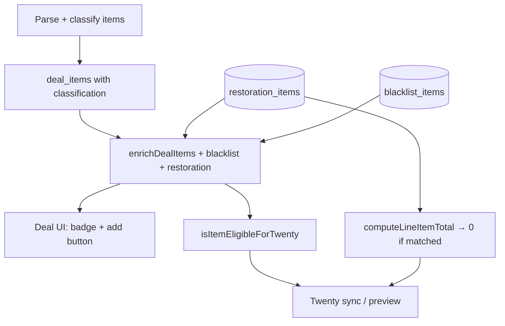

# Restoration Items List — Design Spec

**Date:** 2026-06-27  
**Status:** Approved (design); pending spec review

## Problem

Some Tony line items are **inspection / restoration candidates** — the team checks them on site and may restore them, but restoration work does not contribute to margin. These positions should still appear in Twenty CRM (when they are otherwise eligible for sync) so production can track them, but with **zero monetary value** in Twenty.

Today every eligible item syncs with its Tony-derived price. There is no global way to mark product name patterns as «restoration-only for Twenty pricing».

## Goals

- Maintain a **global, persistent list** of item name patterns flagged as restoration candidates.
- Support **exact** and **substring** match modes (same semantics as blacklist).
- **Only affect pricing**, not eligibility: item must already be eligible for Twenty (`keyword_match`, `llm_confirmed`, or manual `include`, and not blacklisted/excluded) — restoration list does **not** force ineligible items into Twenty.
- Matched eligible items sync to Twenty with **`amountMicros: 0`** (RUB); quantity and other fields unchanged.
- **Do not set** line-item `stage` in Twenty (leave `null` / default).
- Deal `opportunity.amount` excludes restoration rubles (restoration line items contribute 0 to the total).
- **Local parser DB** keeps original Tony `price` / `sum` for audit; zeroing applies only at Twenty sync and preview.
- Manage list in **Settings**; add from deal item row with one click (default: exact match on full name).
- Classification during parse stays unchanged.

## Non-Goals

- Auto-setting Twenty line-item stage to `RESTAVRACIYA`.
- Forcing ineligible items into Twenty because they match restoration list.
- Bulk import/export of restoration patterns (v1).
- Historical Excel export rule changes (v1; can reuse same helper later).
- **Line-item stage delete protection** — see [`2026-06-27-line-item-stage-protection-design.md`](./2026-06-27-line-item-stage-protection-design.md) (separate feature; not part of restoration v1).

---

## Architecture



Restoration is evaluated at **read time** (UI, preview) and **sync time** (line item + opportunity amounts). No column on `deal_items`; no change to parse/classifier.

---

## Data Model

### Table `restoration_items`

```sql
CREATE TABLE IF NOT EXISTS restoration_items (
  id INTEGER PRIMARY KEY AUTOINCREMENT,
  pattern TEXT NOT NULL,
  match_type TEXT NOT NULL CHECK (match_type IN ('exact', 'substring')),
  source_name TEXT,
  created_at TEXT NOT NULL DEFAULT (datetime('now')),
  UNIQUE (pattern, match_type)
);
```

- `pattern` — stored **normalized** (`trim` + lowercase + ё→е), same as blacklist.
- `match_type` — `exact` or `substring`.
- `source_name` — optional original name when added from a deal (display hint in Settings).

### Normalization & matching

Reuse `normalizePattern` from `blacklist.js` (extract to shared helper or import from blacklist module).

| `match_type` | Rule |
|--------------|------|
| `exact` | `normalize(itemName) === normalize(pattern)` |
| `substring` | `normalize(itemName).includes(normalize(pattern))` |

If multiple rules match, any hit → restoration item. `restorationMatch` returns the **first** entry (`created_at ASC`).

---

## Pricing & Sync Logic

### Eligibility (unchanged)

Restoration list does **not** alter `isItemEligibleForTwenty`. Order remains:

1. `sync_override === 'include'` → eligible (unless exclude — unchanged)
2. `sync_override === 'exclude'` → not eligible
3. Blacklist → not eligible
4. `classification ∈ {keyword_match, llm_confirmed}` → eligible
5. else → not eligible

### Zero amount when matched

```js
function isRestorationItem(itemName, restorationList) { /* any match */ }

function computeLineItemTotal(item, deal, restorationList = []) {
  if (isRestorationItem(item.name, restorationList)) return 0;
  // existing Tony/calendar logic unchanged
}
```

- `buildLineItemFields` / `buildLineItemCreateInput` / `buildLineItemUpdateInput` — already use `computeLineItemTotal`; pass `restorationList` through options.
- `buildOpportunityInput` → `computeDealItemsTotal(deal, items, restorationList)` sums eligible items with restoration zeroing.
- **Do not** include `stage` in line-item create/update inputs for restoration (no change to current behaviour).

### Sync path

`syncDealToTwenty` and `buildSyncPreview`:

1. Load blacklist (existing) and restoration list.
2. `getItemsForTwenty(allItems, blacklist)` — unchanged.
3. Pass restoration list into opportunity input and `syncLineItemsDiff` → `buildLineItem*` calls.

Log step (optional): `line_items.restoration_zero` with item names zeroed.

---

## Enrichment API

Extend `enrichDealItems(items, blacklist, restorationList)`:

| Field | Type | Description |
|-------|------|-------------|
| `restorationMatch` | boolean | Name matches any restoration rule |
| `restorationMatchEntry` | object \| null | `{ id, pattern, matchType }` of first match |
| `twentyLineAmount` | number | Rubles sent to Twenty for this line (0 if restoration match, else computed total) |

Existing fields unchanged. Deal list `branding_count` still counts eligible items (restoration items count if eligible — they are tracked in Twenty, just at 0 ₽).

Sync preview `eligibleItems` should expose `twentyLineAmount` or equivalent for UI.

---

## Backend API

New router: `backend/src/routes/restoration.js`, mounted at `/api/restoration`.

| Method | Path | Body / params | Response |
|--------|------|---------------|----------|
| `GET` | `/api/restoration` | — | `{ items: RestorationEntry[] }` |
| `POST` | `/api/restoration` | `{ pattern, matchType, sourceName? }` | `{ item: RestorationEntry }` |
| `DELETE` | `/api/restoration/:id` | — | `{ success: true }` |

Shortcut from deal review:

| Method | Path | Description |
|--------|------|-------------|
| `POST` | `/api/deals/:dealId/items/:itemId/restoration` | Reads item `name`; creates `exact` entry with `pattern = name`, `sourceName = name` |

### Validation & errors

Same as blacklist: 400 empty/invalid type, 409 duplicate, 404 not found.

---

## Frontend UI

### Settings — section «Реставрация»

Mirror blacklist section (below or near «Блеклист»):

- List: `pattern`, badge (`точное` / `фрагмент`), delete.
- Add form: text + match type + «Добавить».
- Hint: *«Eligible-позиции из списка попадают в Twenty с суммой 0 ₽. Не eligible — не синкаются. Стадия не меняется.»*

Hooks: `useRestorationList`, `useAddRestorationItem`, `useRemoveRestorationItem`.

### Deal items — `DealItems.jsx`

Per eligible row matching restoration list:

- Badge **«реставрация»** (distinct from «блеклист»).
- Show Twenty amount as **0 ₽** in preview/summary where line totals are shown.
- **«В реставрацию»** when `!item.restorationMatch` — shortcut POST; invalidate deals + restoration queries.
- Blacklisted or ineligible rows: no restoration badge (match is irrelevant until eligible).

---

## Error Handling

- 409 on duplicate add → «Уже в списке реставрации».
- Sync failure paths unchanged.
- Empty restoration list → no overhead (`isRestorationItem` false).

---

## Testing

### `backend/tests/restoration.test.js` (new)

- `exact` / `substring` matching, ё/е, case.
- Multiple rules; first match returned.

### `backend/tests/twenty-opportunity.test.js` (extend)

- `computeLineItemTotal` returns 0 when name matches restoration list.
- Non-matched item keeps Tony sum.
- `computeDealItemsTotal` sums with restoration zeroing.

### `backend/tests/twenty-line-item.test.js` (extend)

- `buildLineItemCreateInput` → `amount.amountMicros === 0` for restoration match.
- No `stage` in input.

### `backend/tests/twenty-items.test.js` (extend)

- Restoration match on **ineligible** item → still not in `getItemsForTwenty`.
- Restoration match on eligible item → still in `getItemsForTwenty`.

### Manual test plan

1. Add keyword; parse deal with restoration candidate name.
2. Add name to restoration list (exact from deal row) → badge «реставрация», preview amount 0.
3. Sync to Twenty → line item exists, amount 0, stage unset.
4. Opportunity amount excludes restoration rubles.
5. Remove from Settings → next sync restores normal amount.
6. Substring rule matches multiple items → all eligible matches zeroed.
7. Blacklisted item with restoration pattern → still not synced.

---

## File Touch List

| Area | Files |
|------|-------|
| DB | `schema.sql`, `migrate.js` |
| Services | `restoration.js` (new), `twenty-opportunity.js`, `twenty-line-item.js`, `twenty-items.js`, `twenty-sync.js` |
| Routes | `restoration.js` (new), `deals.js`, `index.js` |
| Frontend | `api.js`, `Settings.jsx`, `DealItems.jsx` |
| Tests | `restoration.test.js` (new), extend opportunity / line-item / twenty-items tests |

Optional refactor: extract shared `normalizePattern` + match helpers used by blacklist and restoration into `pattern-match.js` — only if duplication is awkward; not required for v1.

---

## Decisions Log

| Decision | Choice | Rationale |
|----------|--------|-----------|
| vs eligibility | Restoration does not force sync | User B — only eligible items |
| Match modes | exact + substring per entry | User C — like blacklist |
| Twenty stage | Do not set | User B — amount-only signal |
| UI | Settings + deal shortcut | User D |
| Local vs Twenty price | Keep Tony price locally | Audit; zero only in Twenty/preview |
| Architecture | Mirror blacklist table + read-time eval | Proven pattern, no parse changes |
| Opportunity total | Sum with restoration = 0 | Margin excludes restoration |
| Line item delete protection | Separate spec | [`2026-06-27-line-item-stage-protection-design.md`](./2026-06-27-line-item-stage-protection-design.md) |

---

## Follow-up: защита line items (отдельная реализация)

Спека: [`2026-06-27-line-item-stage-protection-design.md`](./2026-06-27-line-item-stage-protection-design.md)

Кратко: при re-parse не удалять и не обновлять позиции в Twenty, у которых `stage` не `null` и не `NOVYY`. Точка изменения — `computeLineItemDiff` / `listLineItemsForOpportunity` в `twenty-line-items-sync.js`.
