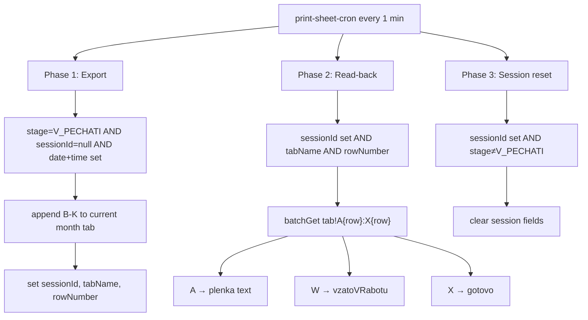

# Twenty → Google Print Sheet Export + Read-back — Design Spec

**Date:** 2026-06-28  
**Status:** Approved — implemented on `feat/print-sheet-export`  
**Related specs:** `2026-06-15-print-sheet-plenka-design.md`, `2026-06-27-line-item-stage-protection-design.md`

## Problem

Production uses a Google Spreadsheet («ПРОИЗВОДСТВО - ПЕЧАТЬ») as the print queue. Rows were added manually. The team now manages positions in Twenty CRM (`dealLineItem`) and wants:

1. **Auto-add a row** to the current month's sheet tab when a **position** (not deal) enters stage «В печати».
2. **Fill manager columns (B–K)** from Twenty so operators don't need to open the sheet for data entry.
3. **Read printer status back** into Twenty: column A (sequential print number → `plenka`), W («Взято в работу»), X («Готово»).
4. **Replace** the legacy plenka lookup that scans 3 full sheet tabs every minute.

**Spreadsheet ID:** `12rGgW0vucmm4eXy4yrtQLRLNcqNpPVznpNdA-c1HuP0`  
**Tab naming:** `{RussianMonth} {YYYY}` (e.g. `Июнь 2026`), current calendar month in `Europe/Moscow`.

---

## Goals

- Cron (extend existing `print-sheet-cron`, every 1 minute) performs export + read-back + session reset.
- One row per «print session»: each time a position re-enters «В печати», a **new row** is created.
- Do **not** export until «Дата готовности печати» and «Время готовности печати» are filled on the position.
- Do **not** write column A (sequential number / «номер плёнки») — sheet handles it; read it back for `plenka`.
- Do **not** write column L (price) or F (restoration).
- Printer columns M–X remain manual in the sheet; W and X sync to Twenty booleans.
- Checking «Готово» in the sheet updates only the boolean in Twenty — **does not change position stage**.
- Deprecate `lookupFilmsForLineItem` / full-tab scanning for plenka.

## Non-Goals

- Bidirectional sync for material/consumption columns (M–V) in v1.
- Blocking stage change in Twenty when date/time fields are empty (cron waits instead).
- Auto-changing position stage when «Гotovo» is checked in the sheet.
- Writing to column A or L.
- Twenty workflows or webhooks for triggers (cron only).

---

## Decisions Summary

| Question | Decision |
|----------|----------|
| Sheet role | Print queue for operators; M–X filled in sheet |
| Row creation | Once per «В печати» session; re-entry → new row |
| Updates to existing rows | No — export is append-only |
| Date/time (I, J) | New fields on position: date + time of print readiness |
| Layout link (G) | Existing field on position (API name TBD via metadata) |
| Responsible (H) | `updatedBy` workspace member at export time |
| Restoration (F) | Skip |
| Price (L) | Skip |
| Department (B) | Static JSON config `companyId → sheet value`; Биржа Лидов → empty (manual in sheet) |
| Trigger | Cron every 1 minute (extend existing print-sheet cron) |
| Missing date/time | Skip export until both filled |
| Plenka (A) | Read-back from known row; deprecate full-tab lookup |
| «Гotovo» (X) | Boolean only, no stage change |

---

## Column Mapping (Export: Twenty → Sheet)

| Col | Header | Source | Notes |
|-----|--------|--------|-------|
| A | № | — | **Do not write.** Sequential print number; read back for `plenka` |
| B | Отдел | `PRINT_SHEET_DEPARTMENT_MAP[companyId]` | Empty if unmapped (e.g. Биржа Лидов) |
| C | Название заказа | `opportunity.name` | |
| D | Ссылка на битрикс | `opportunity.bitrixLink.primaryLinkUrl` | |
| E | Что брендируется | `lineItem.name` | |
| F | Реставрация | — | Skip |
| G | Ссылка на макет | Existing link field on position | Confirm API name at implementation |
| H | Ответственный реализация | `updatedBy` display name | Best-effort at export time |
| I | ДАТА | `dataGotovnostiPechati` | Format `DD.MM.YYYY` |
| J | ВРЕМЯ | `vremyaGotovnostiPechati` | Format `HH:MM` |
| K | Комментарии для печати | `kommentariy` | |
| L | За сколько продан | — | Skip |
| M–V | Printer fields | — | Filled in sheet only (v1) |
| W | Взято в работу | — | Read-back → Twenty |
| X | ГОТОВО | — | Read-back → Twenty |

**Row placement:** Append to the next free row (do not rely on `max(A)+1`). Use Sheets `append` API or find first row where B–K are empty after the header row. Never write column A.

**Tab selection:** Current month only (`buildCurrentMonthTabName(now)` in `Europe/Moscow`), not the 3-tab logic used by legacy plenka lookup.

---

## Department Mapping Config

Static JSON in env `PRINT_SHEET_DEPARTMENT_MAP` or file `backend/config/print-sheet-departments.json`:

```json
{
  "8814cccb-471e-4d05-90cb-261a9395ada8": "Про",
  "df0952a9-c780-4cd1-bd85-ba6f0bf76512": "АРТ",
  "3af2f268-9606-40c4-8944-8c8a70c8aff3": "Аренда+",
  "cbe1d802-b225-46f4-84c9-7a4174e24ed9": "Рентбери/барстрит"
}
```

Allowed sheet dropdown values: `АРТ`, `Аренда+`, `Про`, `Рентбери/барстрит`, `Мебель77`.  
`d9a124be-d8ef-4dd6-b769-f6dc1dd34673` (Биржа Лидов) is intentionally unmapped — operator selects B manually.

Company resolved via `opportunity.companyId`.

---

## Twenty Metadata (dealLineItem — create via MCP)

| name | type | label | Purpose |
|------|------|-------|---------|
| `dataGotovnostiPechati` | DATE | Дата готовности печати | Required before export; col I |
| `vremyaGotovnostiPechati` | TEXT | Время готовности печати | Required before export; col J |
| `printSheetSessionId` | TEXT | *(internal)* | Set after successful export; cleared when stage ≠ V_PECHATI |
| `printSheetTabName` | TEXT | *(internal)* | e.g. `Июнь 2026` |
| `printSheetRowNumber` | NUMBER | *(internal)* | 1-based row index on tab |
| `vzatoVRabotu` | BOOLEAN | Взято в работу | From sheet col W |
| `gotovo` | BOOLEAN | Готово | From sheet col X |

Existing fields used: `name`, `stage`, `kommentariy`, `plenka` (RICH_TEXT), layout link field (name TBD), `updatedBy`.

---

## Session Model (Re-entry → New Row)

```
Position enters V_PECHATI + date/time filled + printSheetSessionId is null
  → export row → set sessionId, tabName, rowNumber

Position leaves V_PECHATI (any other stage or null)
  → cron clears printSheetSessionId, printSheetTabName, printSheetRowNumber

Position re-enters V_PECHATI
  → sessionId is null again → new export → new row
```

`printSheetSessionId` value: UUID or `export-{ISO timestamp}` — opaque token, not derived from row content.

---

## Architecture



### Plenka format (read-back from column A)

Same as legacy:

- If A is non-empty: `{lineItem.name} - {A}` (single line per position row).
- If A is empty: `Плёнка не найдена`.

Skip Twenty update if `plenka.markdown` unchanged (same as current `refreshPlenkaForLineItem`).

### Deprecate legacy plenka lookup

Remove or stop calling:

- `lookupFilmsForLineItem` / `lookupFilmsForOrder` for cron path
- `buildPrintSheetTabNames` for plenka (3-tab scan)
- Full-tab `fetchRowsForTabs` in plenka refresh loop

Keep `print-sheet-normalize.js` only if still needed elsewhere; row-builder may not need name matching.

**Note:** `refreshPlenkaForLineItem` is replaced by unified read-back. Sync hook in `twenty-sync.js` should call export attempt (if applicable), not legacy lookup.

---

## Components

| File | Responsibility |
|------|----------------|
| `print-sheet-tabs.js` | Add `buildCurrentMonthTabName(date)` |
| `print-sheet-departments.js` | Load/parse department map, resolve `companyId → label` |
| `print-sheet-row-builder.js` | Build B–K array from Twenty GraphQL node |
| `print-sheet-append.js` | Sheets API append, return row number |
| `print-sheet-readback.js` | Read A/W/X for known row; update Twenty |
| `print-sheet-export-twenty.js` | GraphQL queries: pending export, active sessions, session reset |
| `print-sheet-cron.js` | Orchestrate export → read-back → reset (remove legacy plenka scan) |
| `print-sheet-lookup.js` | Trim to shared Sheets client or merge into append/readback |
| `config.js` | `PRINT_SHEET_DEPARTMENT_MAP`, write scope for Sheets |

### Google Sheets API

- Upgrade service account scope from `spreadsheets.readonly` to `https://www.googleapis.com/auth/spreadsheets`.
- Service account needs **Editor** on the spreadsheet (was Viewer for read-only plenka).

### GraphQL queries (sketch)

**Pending export:**
```graphql
dealLineItems(filter: {
  and: [
    { stage: { eq: V_PECHATI } }
    { printSheetSessionId: { is: NULL } }
    { dataGotovnostiPechati: { is: NOT_NULL } }
    { vremyaGotovnostiPechati: { is: NOT_NULL } }
  ]
}) { ... opportunity { name bitrixLink companyId } updatedBy { name } ... }
```

**Active sessions (read-back):**
```graphql
dealLineItems(filter: {
  printSheetSessionId: { is: NOT_NULL }
}) { id name plenka printSheetTabName printSheetRowNumber vzatoVRabotu gotovo stage }
```

**Session reset:**
```graphql
dealLineItems(filter: {
  and: [
    { printSheetSessionId: { is: NOT_NULL } }
    { stage: { neq: V_PECHATI } }
  ]
})
```

---

## Error Handling

| Situation | Behavior |
|-----------|----------|
| Date/time not filled | Skip export; retry next cron tick |
| Company not in department map | Column B empty; log info |
| Month tab missing | Log error; do not set sessionId (retry next tick) |
| Google append fails | Log error; do not set sessionId |
| Google read fails | Log error; do not overwrite Twenty fields |
| `updatedBy` unavailable | Column H empty; log warning |
| A empty on read-back | Set plenka to `Плёнка не найдена` |
| plenka / booleans unchanged | Skip Twenty update |
| Stage left V_PECHATI | Clear session fields on next reset phase |

---

## Testing

- **Unit:** `buildCurrentMonthTabName`, row builder (all columns, skips F/L), department resolver, plenka text from A, checkbox parsing (TRUE/FALSE/empty).
- **Unit:** Session logic — export once, reset on stage change, re-export on re-entry.
- **Unit:** Read-back skip when values unchanged.
- **Integration:** Mock Sheets append + batchGet; mock Twenty GraphQL; cron orchestration order.
- **Manual:** Export one position, verify row in sheet, fill W/X/A, verify Twenty updates within 1 minute.

---

## Migration / Rollout

1. Create Twenty fields via MCP.
2. Grant service account Editor on spreadsheet.
3. Deploy with `PRINT_SHEET_DEPARTMENT_MAP` configured.
4. Legacy plenka cron behavior stops scanning full tabs immediately on deploy.
5. Positions already in V_PECHATI without sessionId will export on first cron tick once date/time are set (may create duplicate rows if a manual sheet row already exists — acceptable for v1; operators can delete manual duplicates).

---

## Security

- Service account credentials in environment only.
- Write access limited to print spreadsheet ID.
- Internal session fields (`printSheetSessionId`, etc.) can be hidden from default Twenty views if desired (UI config, not code).
