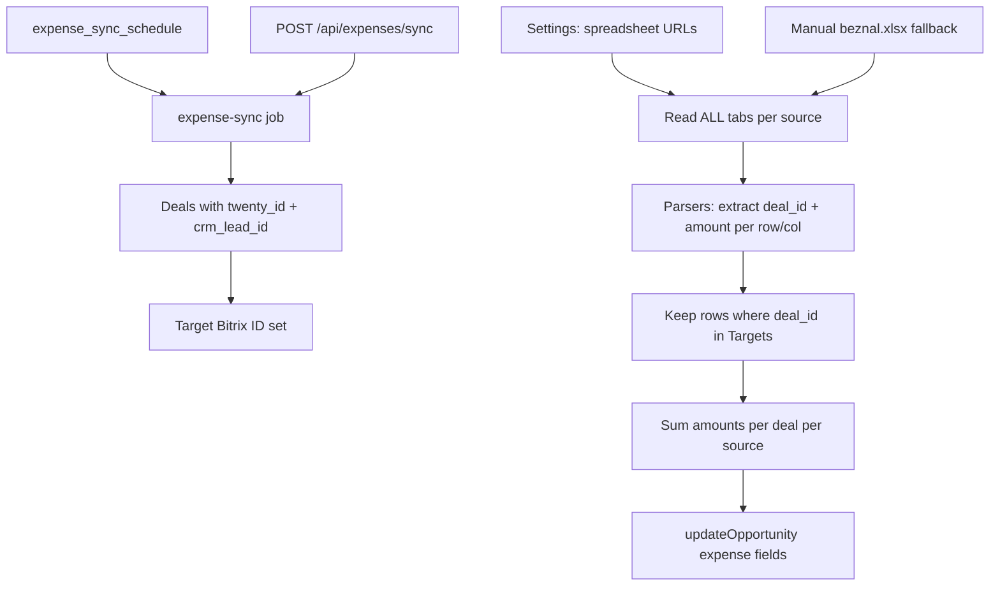

# Deal Expenses → Twenty CRM Integration — Design Spec

**Date:** 2026-06-29  
**Status:** Implemented  
**Related specs:** `2026-06-05-twenty-sync-design.md`, `2026-06-28-print-sheet-export-design.md`  
**Source project:** `deal-expenses` (standalone CLI — parsers reused, **filtering model changed**)

## Problem

Deal expenses are spread across five Google Spreadsheets (field team, printing, milling, logistics, cashless/beznal) with different layouts. The standalone `deal-expenses` script reads local `.xlsx` exports, parses **all tabs**, filters records **by month** (tab year, date in row/name, spill rules), and outputs a monthly Excel pivot.

The team needs this inside **crmparserv2**, but with a **different selection model**:

> **Do not filter spreadsheets by month or tab.** Instead, start from deals synced to Twenty, scan all sheets for matching Bitrix IDs, and pull expense totals for those deals only.

## Goals

- Port `deal-expenses` **parsers** into crmparserv2 backend (ESM).
- Read spreadsheets via existing Google service account (`print-sheet-client.js`).
- **Deal-centric sync:** load deals with `twenty_id` → find matching rows/columns in sheets by Bitrix ID → aggregate → push to Twenty.
- Configurable spreadsheet URLs in Settings.
- Push totals to **custom CURRENCY fields** on Twenty `opportunity`.
- Scheduled sync + manual run.
- Bezнал: Google Sheet when available, manual `.xlsx` upload as fallback.

## Key Difference from Original `deal-expenses` Script

| Aspect | Original `deal-expenses` | crmparserv2 integration |
|--------|-------------------------|-------------------------|
| **What drives the run** | Month/year parameter | **Set of Twenty-synced deals** |
| **Tab filtering** | Skip by year in tab name (`МАЙ 2026`) for printing/milling | **No year/month tab filter** — read all tabs |
| **Record filtering** | `filterByMonth()` + spill rules | **No month filter** on parsed records |
| **Which deals get output** | All deals found in sheets for that month | **Only deals with `twenty_id`** in local DB |
| **Aggregation scope** | Per month | **All matching rows across all tabs** (sum per source) |
| **Primary output** | Excel file | Twenty opportunity fields |

**Still kept from original parsers:**

- Layout-specific parsing (`column_layout`, `row_layout`, `row_layout_logistics`, `beznal_layout`).
- Bitrix ID extraction from URLs (`/crm/deal/details/{id}/`).
- Skip **junk tabs** by name pattern (`болванка`, `Стата`, `копия`) — this is not month filtering.
- Sum multiple rows per deal per source.
- Logistics `allowed_users` filter.

**Removed / not ported:**

- `filterByMonth()`, `month_filter` spill settings.
- `shouldSkipSheetByYear()` (tab name year check).
- Month/year picker as sync scope.
- `rashodPeriod` as «за какой месяц посчитано» (replaced — see fields below).
- «Требует проверки» / uncertain-date workflow (dates not used for selection in v1).

## Non-Goals (v1)

- Excel export of expense summary.
- Writing expenses during `syncDealToTwenty`.
- Month-based expense reports.
- Editing logistics `allowed_users` in UI.
- Margin / profit fields.
- Fuzzy name matching (Bitrix ID remains primary key).

---

## Decisions Summary

| Question | Decision |
|----------|----------|
| Primary output | Twenty CRM opportunity fields |
| **Selection model** | **Deal-centric: Twenty-synced deals → scan sheets** |
| **Sheet filtering** | All tabs except junk patterns; **no month/year tab filter** |
| **Record filtering** | **None by date**; only by matching target deal IDs |
| Field model | 6 CURRENCY + syncedAt DATE_TIME on Opportunity |
| Deal matching | Target set: `deals` with `twenty_id`; match sheet rows via `crm_lead_id` = Bitrix ID |
| Revenue `amount` | Untouched |
| Trigger | Cron (full refresh) + manual «Синхронизировать расходы» |
| Bezнал source | Google Sheet in settings, or latest uploaded `.xlsx` as fallback |
| Rows in sheets for non-Twenty deals | Ignored (not written anywhere) |

---

## Architecture



### Matching (deal-centric)

1. **Build target set** from local DB:
   ```sql
   SELECT id, twenty_id, crm_lead_id
   FROM deals
   WHERE twenty_id IS NOT NULL AND crm_lead_id IS NOT NULL AND crm_lead_id != ''
   ```
2. **Scan all configured spreadsheets** — every tab (except junk patterns).
3. **Parse all rows/columns** with existing layout parsers (no date/month gate).
4. **Keep only records** where `deal_id` ∈ target Bitrix IDs.
5. **Aggregate** per deal: sum `amount` per `source` across all tabs.
6. **Push** to Twenty `opportunity` by `twenty_id`.

If a synced deal has **no rows** in any sheet → write `0` for all expense sources (deal is in target set, expenses explicitly cleared).

If sheet rows reference a Bitrix ID **not** in Twenty-synced deals → ignore.

### Duplicate rows across tabs

Multiple rows for the same `deal_id` + `source` (e.g. deal in both «МАЙ 2026» and «ИЮНЬ 2026» tabs) → **sum all** into one total per source. This is intentional: we do not filter by tab/month.

---

## Data Sources

| Key | Label | Layout type | Default spreadsheet ID |
|-----|-------|-------------|------------------------|
| `field_team` | Выездная команда | `column_layout` | `1cqOIF0MBJggXdUzJ_ll4GaW9jVcDmFPKyrsbWr3ofwk` |
| `printing` | Печать | `row_layout` | `1OYLaUJukGnjvx5qmdHAaKWuVaCTscDsdffzCTqy64pA` |
| `milling` | Фрезеровка | `row_layout` | `1fKlBKDQlOQgvqyEz-qVDWIE5oBKin40RSuRkWvrw-xA` |
| `logistics` | Логистика | `row_layout_logistics` | `1MtGMGzsSS-0ci1HVwdjXcapQQrkaC6qOdI8MdH2mTFM` |
| `beznal` | Безнал | `beznal_layout` | Configurable |

**Logistics `allowed_users`:** `backend/config/expense-logistics-users.json`.

**Skip tab patterns** (junk tabs only): `^болванка`, `^Болванка`, `^Стата`, `копия`.

---

## Twenty CRM — Opportunity Fields

Create on `opportunity`, idempotent via `ensureExpenseFields()`:

| API name | Label | Type | Description |
|----------|-------|------|-------------|
| `rashodVyezdnayaKomanda` | Расход: выездная команда | CURRENCY (RUB) | `field_team` total |
| `rashodPechat` | Расход: печать | CURRENCY | `printing` total |
| `rashodFrezerovka` | Расход: фрезеровка | CURRENCY | `milling` total |
| `rashodLogistika` | Расход: логистика | CURRENCY | `logistics` total |
| `rashodBeznal` | Расход: безнал | CURRENCY | `beznal` total |
| `rashodItogo` | Расход: итого | CURRENCY | Sum of five sources |
| `rashodSyncedAt` | Расход: обновлено | DATE_TIME | Last sync timestamp |

**Write rules:**

- `amountMicros = Math.round(rubles * 1_000_000)`, `currencyCode = 'RUB'`.
- Missing source for a target deal → `0`.
- `rashodItogo` = sum of five sources.
- Do not modify standard `amount` (branding revenue).

---

## Settings (SQLite)

| Key | Description |
|-----|-------------|
| `expense_sheet_field_team` | URL or spreadsheet ID |
| `expense_sheet_printing` | … |
| `expense_sheet_milling` | … |
| `expense_sheet_logistics` | … |
| `expense_sheet_beznal` | … (optional) |
| `expense_sync_schedule` | Cron, e.g. `0 6 * * *` — full deal-centric refresh |

**Removed:** `expense_month_filter` (not applicable).

**UI:**

- Settings → Integrations → **«Расходы»** (spreadsheet URLs + cron).
- Page **«Расходы»** — button «Синхронизировать расходы», job progress, beznal upload. **No month/year picker.**

---

## Bezнал Upload Storage

**Table `expense_beznal_uploads`:**

```sql
CREATE TABLE expense_beznal_uploads (
  id INTEGER PRIMARY KEY AUTOINCREMENT,
  storage_path TEXT NOT NULL,
  original_filename TEXT,
  uploaded_at TEXT NOT NULL DEFAULT (datetime('now'))
);
```

Single latest upload replaces previous. Used only when `expense_sheet_beznal` is empty or unreachable.

**Resolution order for `beznal`:**

1. If `expense_sheet_beznal` configured → Google Sheet (all tabs).
2. Else if upload exists → read latest `.xlsx`.
3. Else → `0` for all deals.

---

## Job Model

**Table `expense_sync_runs`:**

```sql
CREATE TABLE expense_sync_runs (
  id INTEGER PRIMARY KEY AUTOINCREMENT,
  status TEXT NOT NULL DEFAULT 'queued',
  trigger TEXT NOT NULL,
  started_at TEXT,
  finished_at TEXT,
  deals_targeted INTEGER DEFAULT 0,
  deals_updated INTEGER DEFAULT 0,
  deals_with_expenses INTEGER DEFAULT 0,
  error TEXT,
  created_at TEXT NOT NULL DEFAULT (datetime('now'))
);
```

**API:**

| Method | Path | Body | Response |
|--------|------|------|----------|
| POST | `/api/expenses/sync` | `{}` | `{ jobId }` |
| GET | `/api/expenses/jobs/:id` | — | job + progress |
| GET | `/api/expenses/jobs/active` | — | active job or null |
| POST | `/api/expenses/beznal-upload` | multipart `file` | `{ success }` |

**Cron:** `initExpenseSyncCron()` — enqueues full deal-centric sync (no month parameter).

---

## Code Layout

```
backend/src/services/deal-expenses/
  bitrix.js, amounts.js, dates.js   ← dates.js kept for parsers that parse dates internally but NOT for filtering
  pipeline.js                        ← REVISED: runDealCentricPipeline({ sources, targetDealIds })
  readers/*
  sheets-reader.js
  beznal-storage.js

backend/src/services/
  expense-sync.js
  expense-sync-cron.js
  expense-field-setup.js
  expense-jobs.js
```

### Revised `pipeline.js`

```js
// Pseudocode
function runDealCentricPipeline({ sources, targetDealIds, skipSheetPatterns }) {
  const targetSet = new Set(targetDealIds);
  const allRecords = [];

  for (const [sourceKey, sourceConfig] of Object.entries(sources)) {
    const parsed = readAllTabs(sourceConfig); // all tabs, no year filter
    const matched = parsed.filter((r) => r.deal_id && targetSet.has(r.deal_id));
    allRecords.push(...matched);
  }

  return aggregateDeals(allRecords, sourceKeys); // sum per deal per source
}
```

### `expense-sync.js`

1. `ensureExpenseFields()`.
2. Load target deals (`twenty_id`, `crm_lead_id`).
3. `runDealCentricPipeline({ targetDealIds: crm_lead_ids })`.
4. For **every** target deal → `updateOpportunity` (including zeros if no sheet data).
5. Update `expense_sync_runs` stats.

---

## Error Handling

| Situation | Behavior |
|-----------|----------|
| No Google credentials | Job `failed` |
| Missing spreadsheet for one source | Skip source, warning; fail if all empty |
| Bezнал: no sheet and no upload | beznal = 0 for all |
| Twenty error on one deal | Continue; `completed_with_errors` |
| Concurrent job | HTTP 409 |
| No synced deals in DB | Job `completed`, 0 updates |

---

## Testing

| File | Coverage |
|------|----------|
| `pipeline.test.js` | Deal-centric filter: only target IDs kept; sums across tabs |
| `pipeline.test.js` | No month filter: rows from «wrong month» tab still counted if deal_id matches |
| `expense-sync.test.js` | Target deals get zeros when no sheet rows |
| `sheets-reader.test.js` | Mock googleapis |
| `expense-jobs.test.js` | Job lifecycle |

---

## Implementation Order

1. DB migration (`expense_sync_runs`, `expense_beznal_uploads`).
2. Port parsers; implement **deal-centric** `pipeline.js` (not monthly `runPipeline`).
3. `sheets-reader.js`.
4. `expense-field-setup.js`.
5. `expense-sync.js` + jobs + cron.
6. Routes + UI.
7. Tests with multi-tab fixtures proving cross-tab summation without month filter.
