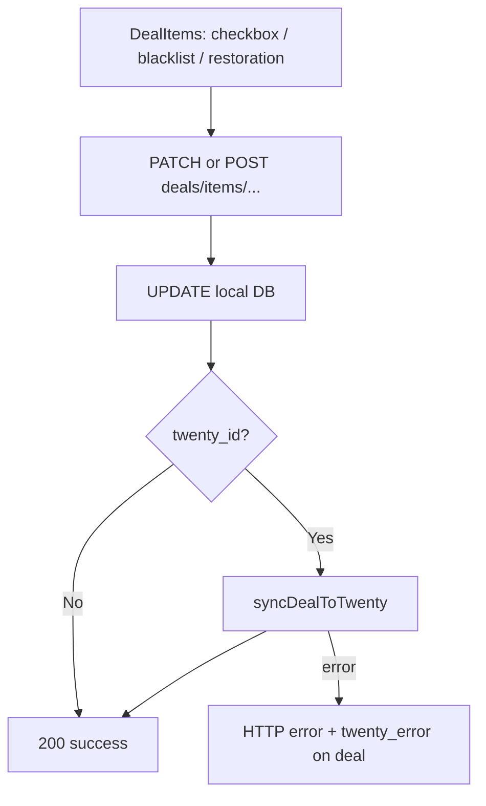
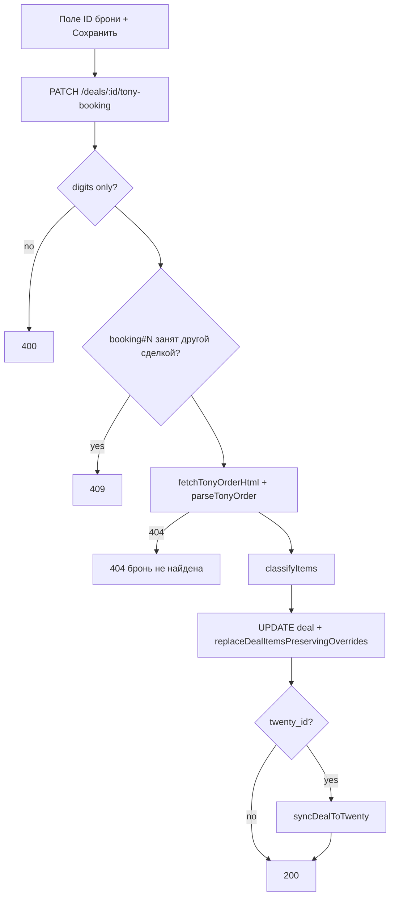

# Редактирование synced-сделок, парсинг прошлых дат, ручная привязка Tony-брони — Design Spec

**Date:** 2026-07-01  
**Status:** Pending review

## Problem

Три связанные ограничения мешают повседневной работе:

1. **Synced-сделки заблокированы в UI** — чекбоксы «В Twenty», блеклист и реставрация недоступны (`readOnly` при `approval_status === 'synced'`), хотя бэкенд и re-sync уже реализованы (см. non-goal v1 в [`2026-06-09-deal-resync-design.md`](./2026-06-09-deal-resync-design.md)).
2. **Ручной парсинг не уходит в прошлое** — `normalizeParseRange()` поднимает start до сегодня; UI ставит `min` на поле даты. Автопарсинг должен остаться «от сегодня».
3. **Нет ручной привязки ID брони Tony** — `tony_order_id` попадает только из заголовка календаря или через `import-by-booking` (создаёт отдельную synthetic-сделку). Календарные сделки без номера в заголовке остаются без Tony-данных и без ссылки `tonyLink` в Twenty.

## Goals

### 1. Редактирование синхронизированных сделок

- Разблокировать UI позиций для `synced`-сделок (как для `pending`).
- После изменения `sync_override`, сброса overrides, добавления в блеклист/реставрацию — **автоматически** вызывать `syncDealToTwenty`, если у сделки есть `twenty_id`.
- Кнопку «Пересинхр.» оставить для ручного retry при ошибке.

### 2. Ручной парсинг прошлых дат

- Разрешить любую прошлую дату в ручном `POST /parsing/run` (только валидация `from ≤ to`).
- Scheduler и tier-расписание **без изменений** — всегда от сегодня.
- `GET /parsing/defaults` — по-прежнему today + 2 недели.

### 3. Ручная привязка ID брони Tony

- В UI сделки: поле «ID брони Tony» + сохранение.
- При сохранении: загрузить заказ из Tony, обновить метаданные и позиции, сохранить `sync_override` по имени.
- Если сделка уже synced (`twenty_id`) — сразу пересинхронизировать в Twenty (включая `tonyLink`).

## Non-Goals

- Ручное создание/удаление строк `deal_items` вне Tony/календаря.
- Снятие привязки брони (очистка `tony_order_id`) — v1 не делаем.
- Автопарсинг в прошлое.
- Лимит глубины прошлых дат для ручного парсинга.
- Слияние двух сделок при конфликте брони — возвращаем ошибку.
- Изменение `stage` opportunity/line items в Twenty.

---

## Decisions Summary

| Вопрос | Решение |
|--------|---------|
| Синк после правок позиций | Автоматически, без отдельной кнопки |
| Глубина ручного парсинга | Без лимита |
| Привязка брони | Сразу fetch Tony + обновление сделки |
| Конфликт `booking#N` | HTTP 409, другая сделка уже владеет ключом |
| Заголовок сделки при привязке | Сохранить календарный title/company/manager/contact |
| Защита стадий line items | Без изменений (существующее поведение re-sync) |

---

## Part 1: Редактирование synced-сделок

### Текущее состояние

| Слой | Поведение |
|------|-----------|
| Frontend | `readOnly={deal.approval_status === 'synced'}` в `DealCard.jsx`, `DealRow.jsx` |
| Backend | Эндпоинты `sync-override`, `blacklist`, `restoration`, `reset-sync-overrides` не проверяют статус |
| Re-sync | `POST /deals/:id/resync` — только вручную |

### Архитектура



### Backend

Новый хелпер в `twenty-sync.js` (или `deals.js`):

```js
export async function resyncDealIfSynced(dealId) {
  const deal = getDb().prepare('SELECT twenty_id FROM deals WHERE id = ?').get(dealId);
  if (!deal?.twenty_id) return null;
  return syncDealToTwenty(dealId);
}
```

Вызывать после успешного локального изменения в:

- `PATCH /:dealId/items/:itemId/sync-override`
- `POST /:id/items/reset-sync-overrides`
- `POST /:dealId/items/:itemId/blacklist`
- `POST /:dealId/items/:itemId/restoration`

Ответ API при synced-сделке:

```json
{
  "success": true,
  "sync": { "action": "updated", "twentyId": "..." }
}
```

При ошибке синка — пробросить исключение (как в `approve`); локальные правки **не откатывать**; `syncDealToTwenty` записывает `twenty_error`.

### Frontend

- Убрать `readOnly={deal.approval_status === 'synced'}` — всегда `readOnly={false}` (или удалить проп).
- Чекбоксы/disabled на время `isPending` мутации (запрос дольше из-за синка).
- Инвалидировать `deal`, `deals`, `sync-logs` после успеха (расширить `onSuccess` в `useUpdateItemSyncOverride`, `useResetSyncOverrides`, `useAddItemToBlacklist`, `useAddItemToRestoration`).

---

## Part 2: Ручной парсинг прошлых дат

### Текущее состояние

- `normalizeParseRange()` — clamp start/end к `getMinParseStart(now)`.
- `normalizeExportRange()` — уже без clamp (паттерн для копирования).
- Dashboard: `min={defaults?.startDate}` на поле «С».

### Backend

Новая функция в `crm-dates.js`:

```js
/** Manual parse only: no min-date clamp; validates from <= to. */
export function normalizeManualParseRange(startDate, endDate, now = new Date()) {
  const defaults = getDefaultParseRange(now);
  // expand YYYY-MM-DD to Moscow day bounds (same as normalizeParseRange)
  // if only one bound missing, use defaults
  // throw if startTs > endTs
  // do NOT clamp to getMinParseStart
}
```

- `POST /parsing/run` → `normalizeManualParseRange` вместо `normalizeParseRange`.
- `scheduler.js`, `getParseRangeForTier`, `normalizeParseRange` — **не трогать**.

### Frontend

- Убрать атрибут `min` на поле «С» в `Dashboard.jsx`.
- Обновить подсказку: «По умолчанию — с сегодня на 2 недели вперёд. Для ручного запуска можно указать прошлые даты.»

### Tests

- `normalizeManualParseRange` принимает прошлую дату.
- `normalizeManualParseRange` отклоняет `from > to`.
- `normalizeParseRange` по-прежнему clamp'ит (регрессия).
- `getParseRangeForTier` start = today (регрессия).

---

## Part 3: Ручная привязка Tony-брони

### Текущее состояние

- `tony_order_id` + `deal_key` (`booking#N`) задаются парсером или `import-by-booking`.
- `import-by-booking` создаёт/обновляет synthetic-сделку с `crm_event_id = 'import'`, не привязывает к календарной.
- `twenty-opportunity.js` строит `tonyLink` из `deal.tony_order_id`.
- `deal_key` уникален — нельзя два раза `booking#169120`.

### Архитектура



### API

`PATCH /deals/:id/tony-booking`

Request:

```json
{ "bookingNumber": "169120" }
```

Validation:

- `bookingNumber` — только цифры (`/^\d+$/`), иначе 400.
- Сделка с `id` существует, иначе 404.
- Другая сделка с `deal_key = booking#${bookingNumber}` и `id !== :id` → 409 с текстом «Бронь уже привязана к другой сделке».

### Сервис `attachTonyBooking(dealId, bookingNumber)`

Переиспользовать из `import-by-booking.js` / `parser.js`:

- `ensureTonyReady()` → `fetchTonyOrderHtml` → `parseTonyOrder`
- Пустой заказ / нет позиций → 404 «Нет позиций в заказе Tony»
- `classifyItems(buildTonyItems(order), keywords, llmPrompt)`
- `buildTonyDealFields(order)`, `tonyContentHash(order)`

Обновление сделки (сохранить календарную идентичность):

| Поле | Действие |
|------|----------|
| `crm_event_id` | не менять |
| `title`, `company_code`, `manager_name` | не менять |
| `contact_*` | не менять |
| `tony_order_id` | `bookingNumber` |
| `deal_key` | `booking#${bookingNumber}` |
| `data_source` | `'tony'` |
| `address`, `work_time`, `arrival_time`, `dismantle_time`, `load_date`, `load_time`, `budget`, `start_date`, `end_date` | из Tony |
| `content_hash` | `tonyContentHash(order)` |
| `twenty_id`, `approval_status`, `synced_at` | не менять напрямую |

Позиции: `replaceDealItemsPreservingOverrides` с `buildOverrideMap` существующих items.

После обновления: `resyncDealIfSynced(dealId)`.

Ответ 200:

```json
{
  "success": true,
  "dealId": 42,
  "bookingNumber": "169120",
  "itemCount": 5,
  "sync": { "action": "updated", "twentyId": "..." }
}
```

`sync` — `null`, если сделка ещё не synced.

### Frontend

В развёрнутой карточке сделки (`DealCard` / `DealRow`), блок деталей:

- Поле ввода «ID брони Tony» (только цифры).
- Кнопка «Привязать» / «Сохранить».
- Показать текущий `tony_order_id`, если есть (read-only или prefill).
- Состояния: loading, ошибка (409 конфликт, 404 не найдена, Tony не настроен).
- После успеха — invalidate `deal`, `deals`.

Доступно для любого `approval_status` (pending, synced, approved).

### Поведение при повторном парсинге

После привязки `deal_key = booking#N` — сделка участвует в booking-centric reconciliation как обычная Tony-сделка. Парсер не дублирует её при появлении того же номера в заголовке другого события.

### Tests

- Успешная привязка к calendar-сделке: `tony_order_id`, `deal_key`, `data_source`, items обновлены.
- `sync_override` / `twenty_id` на items сохранены по имени.
- Конфликт `booking#N` → 409.
- Synced-сделка → mock `syncDealToTwenty` вызван.
- Невалидный номер → 400; Tony 404 → 404.

---

## Error Handling

| Сценарий | Поведение |
|----------|-----------|
| Twenty недоступен при auto-resync | HTTP 5xx/4xx, `twenty_error` на сделке, локальные правки сохранены |
| Tony session expired при привязке | Ошибка до изменения сделки (fetch до UPDATE) |
| Бронь без позиций | 404, сделка не меняется |
| Парсинг: from > to | 400 |

Для привязки брони: **атомарность** — сначала fetch+parse Tony, затем одна транзакция UPDATE deal + replace items. При ошибке fetch — сделка не трогается.

---

## Files to Change (implementation hint)

| Area | Files |
|------|-------|
| Auto-resync | `backend/src/services/twenty-sync.js`, `backend/src/routes/deals.js` |
| Synced UI | `frontend/src/components/DealCard.jsx`, `DealRow.jsx`, `api.js` |
| Past parse | `backend/src/utils/crm-dates.js`, `backend/src/routes/parsing.js`, `frontend/src/pages/Dashboard.jsx`, `backend/tests/crm-dates.test.js` |
| Tony booking | `backend/src/services/attach-tony-booking.js` (new), `backend/src/routes/deals.js`, `frontend` deal detail, tests |

---

## Related Specs

- [`2026-06-09-deal-resync-design.md`](./2026-06-09-deal-resync-design.md) — update path, overrides preservation
- [`2026-06-27-line-item-stage-protection-design.md`](./2026-06-27-line-item-stage-protection-design.md) — preserved line items on re-sync
- [`2026-06-19-tony-order-source-design.md`](./2026-06-19-tony-order-source-design.md) — booking-centric keys
- [`2026-06-27-restoration-items-design.md`](./2026-06-27-restoration-items-design.md) — blacklist/restoration shortcuts
