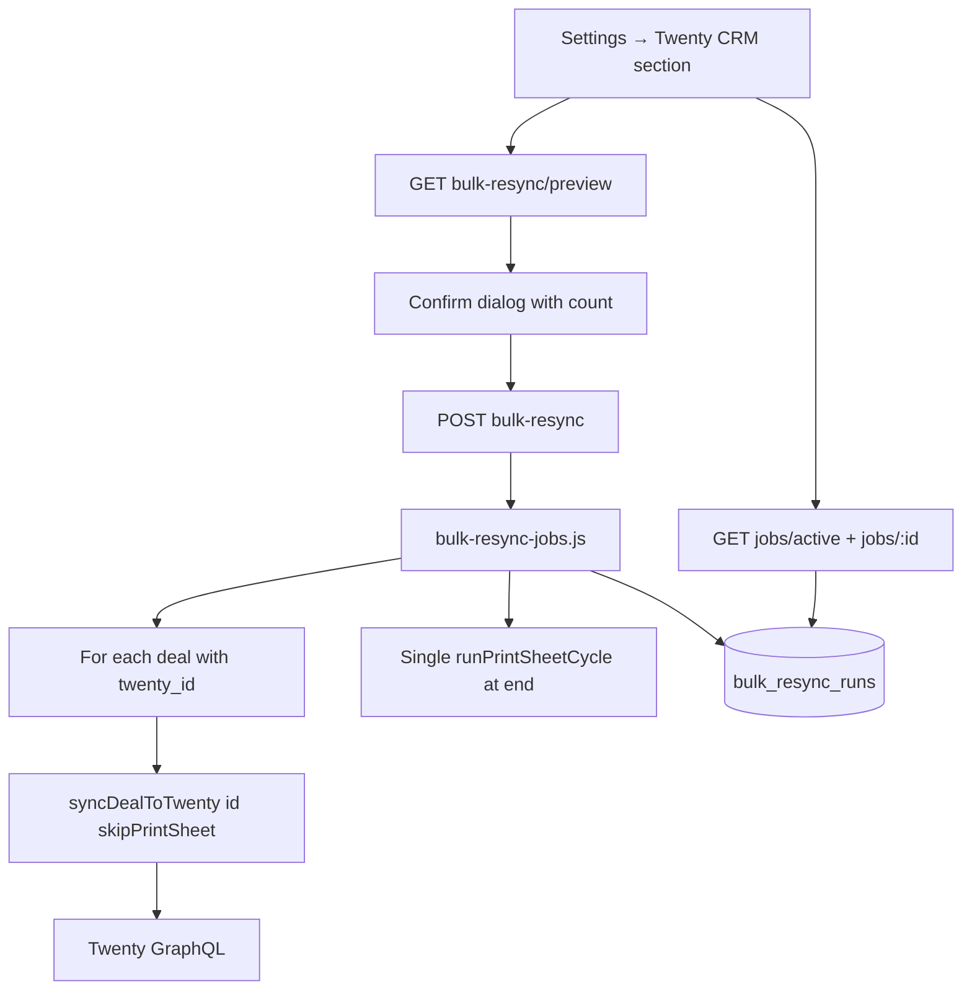

# Bulk Resync — Apply Global Filters to Synced Deals — Design Spec

**Date:** 2026-07-03  
**Status:** Approved (design); pending spec review

## Problem

Global filter lists — **blacklist**, **restoration**, **podryad** — are evaluated at **sync time** via `getItemsForTwenty()` and related helpers in `twenty-sync.js`. They do not require re-parsing or re-classification.

When new patterns are added to these lists, already-synced deals in Twenty remain unchanged until each deal is individually resynced. Today resync happens only when:

- parse detects a `content_hash` change on a synced deal;
- user clicks «Пересинхр.» on a deal;
- user mutates an item from the deal row (override / blacklist / restoration / podryad).

There is no way to **bulk-apply** updated global filters to all deals that already have a `twenty_id`.

## Goals

- Provide a **manual, on-demand** operation triggered by a button in Settings.
- Resync **all deals** with `twenty_id IS NOT NULL` (non-empty).
- Reuse existing `syncDealToTwenty()` so blacklist eligibility, restoration zero-pricing, podryad tagging, opportunity amount, and line-item diff behave exactly as in single-deal resync.
- Run as a **background job** with progress UI (same UX pattern as expense sync).
- Allow **only one active job** at a time (409 if already running).
- **Continue on per-deal errors**; collect failures in job result.
- Show deal count in a confirmation dialog before starting (`/preview` endpoint).

## Non-Goals

- Auto-resync when global lists change in Settings.
- Re-parse or re-classify items (keywords / LLM) — separate workflow.
- Filter by date range or manual checkbox selection.
- Per-deal dry-run diff preview before bulk run.
- Changing line-item stage protection rules (existing behavior applies).

---

## Context: How Filters Apply Today

| Filter | Applied when | Stored on `deal_items`? |
|--------|--------------|-------------------------|
| Blacklist | Sync / UI enrich | No — read from `blacklist_items` |
| Restoration (0 ₽) | Sync / UI enrich | No — read from `restoration_items` |
| Podryad (`tip`) | Sync / UI enrich | No — read from `podryad_items` |

Bulk resync only needs to re-run sync; no parse pipeline changes.

### Known limitation (unchanged)

Line items in Twenty with `stage` other than `null` or `NOVYY` are **not updated or deleted** on resync (`twenty-line-items-sync.js`). After bulk resync, protected line items may remain stale in Twenty. This is expected and documented to the operator.

---

## Architecture



Job orchestration mirrors `expense-jobs.js`: create row in SQLite, execute asynchronously, expose status via REST, poll from frontend.

---

## Data Model

### Table `bulk_resync_runs`

```sql
CREATE TABLE IF NOT EXISTS bulk_resync_runs (
  id INTEGER PRIMARY KEY AUTOINCREMENT,
  status TEXT NOT NULL DEFAULT 'queued',
  trigger TEXT NOT NULL DEFAULT 'manual',
  started_at TEXT,
  finished_at TEXT,
  deals_total INTEGER DEFAULT 0,
  deals_done INTEGER DEFAULT 0,
  deals_updated INTEGER DEFAULT 0,
  deals_failed INTEGER DEFAULT 0,
  errors_json TEXT,
  error TEXT,
  created_at TEXT NOT NULL DEFAULT (datetime('now'))
);
```

- `status`: `queued` → `running` → `completed` | `completed_with_errors` | `failed`
- `errors_json`: JSON array of `{ dealId, error }` for failed deals (cap at 50 entries in v1)
- `error`: top-level fatal error message if job aborts entirely

Migration via `migrate.js` + entry in `schema.sql`.

---

## Backend

### Service: `backend/src/services/bulk-resync-jobs.js`

| Function | Purpose |
|----------|---------|
| `countSyncedDeals()` | `SELECT COUNT(*) FROM deals WHERE twenty_id IS NOT NULL AND twenty_id != ''` |
| `listSyncedDealIds()` | Ordered by `id ASC` for deterministic runs |
| `createBulkResyncJob({ trigger })` | Insert row, return job handle |
| `getBulkResyncJob(jobId)` | Load from memory cache or DB |
| `getActiveBulkResyncJob()` | First job with status `queued` or `running` |
| `executeBulkResyncJob(jobId)` | Main loop |

**Execution loop:**

1. Load all synced deal IDs; set `deals_total`.
2. For each deal (index > 0: `await delay(1000)` — same as `parser.js` post-parse resync):
   - Call `syncDealToTwenty(dealId, { skipPrintSheetRefresh: true })`.
   - On success: increment `deals_updated` if action is `updated` or `updated_empty`.
   - On failure: increment `deals_failed`, append to `errors_json`, log, continue.
   - Increment `deals_done`; persist progress to DB periodically (every deal or every 5 deals).
3. If at least one deal updated successfully: run **one** `runPrintSheetCycle()` via existing Twenty gql client (same as `refreshPrintSheetAfterSync`, but deferred).
4. Set final status: `completed` or `completed_with_errors`.

### Change to `syncDealToTwenty`

Add optional second argument:

```js
syncDealToTwenty(dealId, { skipPrintSheetRefresh = false } = {})
```

When `skipPrintSheetRefresh` is true, skip `refreshPrintSheetAfterSync()` inside the function. Bulk job owns print sheet refresh at the end.

### Routes: extend `backend/src/routes/deals.js`

Register **before** `/:id` routes:

| Method | Path | Response |
|--------|------|----------|
| `GET` | `/bulk-resync/preview` | `{ count: number }` |
| `POST` | `/bulk-resync` | `{ jobId }` — 409 if active job exists |
| `GET` | `/bulk-resync/jobs/active` | job object or `null` |
| `GET` | `/bulk-resync/jobs/:id` | job object or 404 |

POST body (optional): `{ trigger: 'manual' }`.

Job execution: fire-and-forget `executeBulkResyncJob(jobId).catch(...)` — same as `expenses.js`.

---

## Frontend

### Location

**Settings → Integrations → Twenty CRM** section (`Settings.jsx`), below opportunity stage selector.

### UI elements

1. **Button:** «Применить фильтры ко всем синхронизированным сделкам»
2. **On click:** fetch preview count → `window.confirm` (or existing modal pattern) with text like: «Будет пересинхронизировано N сделок. Продолжить?»
3. **During job:** progress panel (reuse Expenses page patterns):
   - Status label (queued / running / completed)
   - `deals_done / deals_total`
   - `deals_updated`, `deals_failed`
   - Disable start button while active
4. **On complete:** show summary; list failed deal IDs if any

### API hooks (`frontend/src/api.js`)

- `useBulkResyncPreview()`
- `useStartBulkResync()`
- `useActiveBulkResyncJob()` — poll every 2s while running
- `useBulkResyncJob(jobId)`

---

## Error Handling

| Scenario | Behavior |
|----------|----------|
| Twenty not configured | Job fails immediately with clear error |
| Single deal sync error | Log, record in `errors_json`, set `deals.twenty_error`, continue |
| Active job exists | POST returns 409 |
| Print sheet refresh fails at end | Log warning; job still `completed` / `completed_with_errors` based on deal results |
| Server restart mid-job | In-memory cache lost; DB row may stay `running` — v1 accepts this; operator can retry (future: stale-job cleanup) |

---

## Testing

| Test | File |
|------|------|
| `countSyncedDeals` / deal selection query | `bulk-resync-jobs.test.js` |
| Job loop: success, partial failure, continue-on-error | mock `syncDealToTwenty` |
| Print sheet called once at end, not per deal | mock `runPrintSheetCycle` |
| 409 when active job | route test |
| `skipPrintSheetRefresh` option | extend `twenty-sync.test.js` |

---

## Files to Create / Modify

| File | Change |
|------|--------|
| `docs/superpowers/specs/2026-07-03-bulk-resync-filters-design.md` | This spec |
| `backend/src/db/schema.sql` | Add `bulk_resync_runs` |
| `backend/src/db/migrate.js` | Migration for table |
| `backend/src/services/bulk-resync-jobs.js` | New |
| `backend/src/services/twenty-sync.js` | `skipPrintSheetRefresh` option |
| `backend/src/routes/deals.js` | Bulk resync routes |
| `backend/tests/bulk-resync-jobs.test.js` | New |
| `backend/tests/twenty-sync.test.js` | Skip print sheet test |
| `frontend/src/api.js` | Hooks |
| `frontend/src/pages/Settings.jsx` | Button + progress UI |

---

## Operator Workflow

1. Add new patterns to blacklist / restoration / podryad in Settings.
2. Open Settings → Integrations → Twenty CRM.
3. Click «Применить фильтры…», confirm count.
4. Wait for job to finish; check failed deals if any.
5. Verify sample deals in Twenty (optional).

Expected duration: ~1 second per synced deal plus Twenty API time (e.g. 100 deals ≈ 2–5 minutes).
