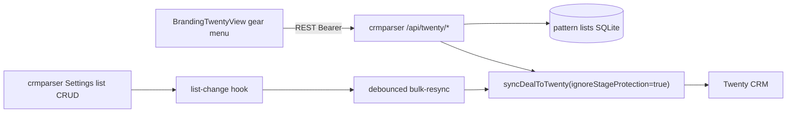

# Twenty Line-Item Lists Integration — Design Spec

**Date:** 2026-07-10  
**Status:** Approved  
**Repos:** `crmparserv2`, `BrandingTwentyView`

## Problem

1. **Workflow mismatch:** Daily work happens in Twenty (`BrandingTwentyView`), but blacklist / restoration / podryad / banner lists are managed in crmparser Settings. There is no way to assign a position to a list from the deals board.

2. **Manual filter application:** After changing global lists, the operator must click «Применить фильтры» (bulk-resync). List CRUD endpoints do not trigger any resync.

3. **Filters not applying reliably:** Example deal «АРТ/кейтеринг // 11 июля / Ольга / тверь спорт дети…» still shows «Велотележка для мороженого» with full sale amount after adding a restoration pattern and running bulk-resync. Position was in stage «Новый» (`NOVYY`), so stage protection is not the cause.

### Root causes identified

| Cause | Impact |
|-------|--------|
| List changes do not auto-trigger resync | Patterns saved in SQLite but Twenty unchanged until manual bulk-resync |
| `resyncDealIfSynced()` uses default stage protection | Per-deal resync after item action may skip updates on non-`NOVYY` items |
| `computeLineItemDiff()` matches line items by raw name | Case/whitespace differences prevent update |
| Exact vs substring match type confusion | Pattern `велотележка` (exact) does not match `Велотележка для мороженого` |
| Twenty UI reads Twenty directly | No visibility into list match status from crmparser |

## Goals

- Add a **gear icon** on each position row in `BrandingTwentyView` to assign the position to blacklist, restoration, podryad, or banner.
- **Auto-apply filters** in two cases:
  1. When any global list changes (Settings CRUD) — debounced background bulk-resync.
  2. When a list action is taken from Twenty gear menu — immediate resync of that deal.
- **Fix sync reliability:** normalized name matching in diff; always bypass stage protection on list-triggered resyncs.
- Keep crmparser SQLite as **source of truth** for pattern lists.
- Retain manual «Применить фильтры» button as fallback.

## Non-Goals

- Moving list storage to Twenty CRM objects.
- Re-parse or re-classify items (keywords / LLM).
- Removing crmparser Settings list management UI.
- Sync override (manual include/exclude) from Twenty gear menu — future enhancement.

---

## Architecture



### Data flow

1. Operator clicks gear on a `dealLineItem` row in BrandingTwentyView.
2. Front component calls `POST /api/twenty/line-items/:twentyLineItemId/add-to-list`.
3. crmparser resolves `deal_items` row by `twenty_id`, creates pattern entry (exact match on item name), resyncs the parent deal.
4. Twenty line item `amount` updated to 0 ₽ (restoration) or line item deleted (blacklist), etc.

### Auth

New env var `TWENTY_APP_API_SECRET` on crmparser. BrandingTwentyView stores matching secret via Twenty app runtime env (`CRMPARSER_API_SECRET`). Requests use `Authorization: Bearer <secret>`. New middleware `twentyAppAuthMiddleware` on `/api/twenty/*` routes only.

CORS: allow Twenty app origin when `TWENTY_APP_CORS_ORIGIN` is set.

---

## crmparser API

### `GET /api/twenty/line-items/:twentyLineItemId/list-status`

Returns current list match flags for UI badges.

```json
{
  "blacklisted": false,
  "restorationMatch": true,
  "podryadMatch": false,
  "bannerMatch": false,
  "pattern": "велотележка для мороженого",
  "dealId": 42,
  "dealTwentyId": "uuid-opp"
}
```

404 if `deal_items.twenty_id` not found.

### `POST /api/twenty/line-items/:twentyLineItemId/add-to-list`

```json
{ "list": "blacklist" | "restoration" | "podryad" | "banner" }
```

- Resolves item by `twenty_id`.
- Creates list entry: `pattern = item.name`, `matchType = 'exact'`, `sourceName = item.name`.
- 409 if entry already exists (idempotent response OK).
- Calls `syncDealToTwenty(dealId, { ignoreLineItemStageProtection: true })`.
- Returns `{ success: true, sync: { action, itemCount } }`.

### `POST /api/twenty/opportunities/:twentyOppId/resync`

Resync single deal by `deals.twenty_id`. Returns sync result.

---

## Sync fixes

### 1. Stage protection on list-triggered resync

`resyncDealIfSynced(dealId)` must pass `ignoreLineItemStageProtection: true` to `syncDealToTwenty()`.

All call sites triggered by list changes (item actions, twenty API, auto bulk-resync) use this flag.

### 2. Normalized name matching in diff

In `computeLineItemDiff()`, build `existingByName` map keyed by `normalizePattern(li.name)` and look up with `normalizePattern(item.name)`.

### 3. Auto bulk-resync on list change

New service `list-change-resync.js`:

- `scheduleListChangeResync()` — debounce 5 s, coalesce multiple list edits into one job.
- Reuses `createBulkResyncJob({ trigger: 'list_change' })` from `bulk-resync-jobs.js`.
- Skips if an active bulk-resync job is already running (queue for next cycle or extend debounce).

Hook into `create/delete` handlers in:
- `routes/blacklist.js`
- `routes/restoration.js`
- `routes/podryad.js`
- `routes/banner.js`
- `routes/deals.js` item list POST endpoints

---

## BrandingTwentyView UI

### Gear menu (`LineItemListMenu`)

- Location: `ChildNameCell` in `src/deals-board/cells/overrides.tsx`.
- Icon: existing `SettingsIcon` (22×22 button, same style as `ParentNameCell` actions).
- Popover: 4 actions mirroring crmparser `DealItems.jsx`.
- Already-in-list entries: disabled with checkmark.
- On success: invalidate line items query; show brief success state.
- Badges on position name: «реставрация · 0 ₽», «блеклист», «подряд», «баннер» (from `list-status` API).

### Config

Runtime env (Twenty app secrets):

| Variable | Purpose |
|----------|---------|
| `CRMPARSER_API_URL` | Base URL, e.g. `https://parser.example.com/api` |
| `CRMPARSER_API_SECRET` | Bearer token matching `TWENTY_APP_API_SECRET` |

### Version bump

Increment `package.json` version on every BrandingTwentyView deploy (e.g. `0.2.70` → `0.2.71`).

---

## Error handling

| Case | Response / UX |
|------|---------------|
| Line item not in crmparser DB | 404 + message «Позиция не найдена в парсере» |
| Deal not synced to Twenty | 404 |
| List entry already exists | 200 idempotent |
| crmparser unreachable from Twenty | Toast error, gear menu stays open |
| Resync fails | 500 with error message; list entry still created |

---

## Testing

### crmparserv2 (Vitest)

- `computeLineItemDiff` with normalized names (case-insensitive match).
- `resyncDealIfSynced` passes `ignoreLineItemStageProtection: true`.
- Twenty API routes: add-to-list → creates entry + triggers sync.
- `list-change-resync`: debounce coalesces multiple calls.
- Restoration: item with substring pattern → `amount.amountMicros = 0` after sync.

### BrandingTwentyView (Vitest)

- `LineItemListMenu` renders 4 actions, disables already-applied.
- `crmparser.ts` client builds correct URLs and auth header.

### Manual

1. Add «велотележка» as **substring** in restoration list → auto bulk-resync runs → position shows 0 ₽ in Twenty.
2. Gear menu → «В реставрацию» on a position → immediate 0 ₽ without visiting Settings.
3. Verify «Велотележка для мороженого» deal after fix.

---

## Migration / rollout

1. Deploy crmparser with new env vars and API routes.
2. Set `TWENTY_APP_API_SECRET` and `TWENTY_APP_CORS_ORIGIN` on server.
3. Configure secrets in Twenty app for BrandingTwentyView.
4. Deploy BrandingTwentyView (version bump).
5. Re-run bulk-resync once to fix existing stale positions (or rely on next list edit auto-trigger).
