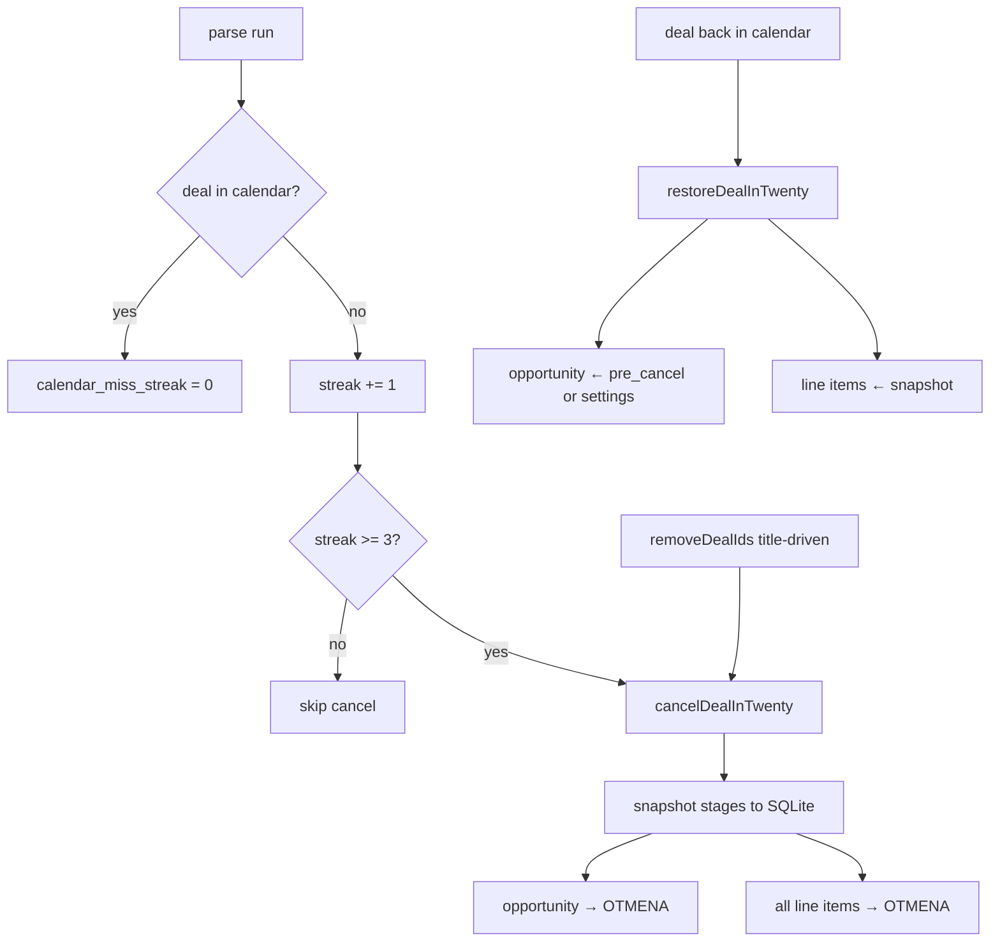

# Защита от ложной отмены сделки и восстановление стадий позиций — Design Spec

**Дата:** 2026-08-04  
**Статус:** Approved  
**Связанные спеки:** `2026-06-27-line-item-stage-protection-design.md`, `2026-06-20-twenty-line-items-design.md`, `2026-06-09-deal-resync-design.md`

## Проблема

Парсер может временно «не увидеть» сделку в календаре и вызвать `cancelDealInTwenty`:

1. Opportunity → `OTMENA`
2. Все line items → `OTMENA` (включая позиции в `V_PECHATI` / `V_RABOTE` с ручной работой)

Когда сделка снова появляется, `restoreDealInTwenty` возвращает **только** стадию opportunity (из settings / `NOVYY`), а позиции остаются в `OTMENA`. Стадия `OTMENA` у line item защищена от sync (`isProtectedLineItemStage`), поэтому повторный sync их не оживляет.

Пример: сделка Tony #168244 — 2026-08-03 ~23:07 UTC cancel (позиции с `V_PECHATI`), 2026-08-04 ~06:07 UTC restore opportunity → `NOVYY`, позиции остались в отмене.

## Цели

- **Реже ложные отмены** по calendar miss: cancel только после **3 подряд** parse-прогонов без события в календаре.
- **Title-driven cancel** (`removeDealIds`, букинг убран из заголовка) — **сразу**, без streak.
- При любом cancel: **снимок** стадий opportunity и line items в локальной SQLite, затем всем позициям `OTMENA`.
- При restore: вернуть opportunity и **позиции** из снимка; очистить snapshot и streak.
- Покрыть unit-тестами streak, cancel snapshot, restore.

## Нецели (v1)

- UI / Telegram-уведомления о miss streak или restore.
- Backfill уже сломанных сделок (ручной fix или отдельный job).
- Изменение правил `isProtectedLineItemStage` при обычном sync.
- Soft-cancel без перевода позиций в `OTMENA`.
- Хранение снимка в полях Twenty.
- Grace на title-driven cancel.
- Откат print-sheet / прочих побочных полей при restore (только `stage`).

---

## Decisions Summary

| Вопрос | Решение |
|--------|---------|
| Ложные calendar miss | Streak ≥ 3 подряд parse без события |
| Title-driven remove | Cancel сразу |
| Позиции при cancel | Snapshot → всем `OTMENA` |
| Позиции при restore | Вернуть стадии из snapshot |
| Opportunity при restore | `pre_cancel_opportunity_stage`, иначе fallback `getOpportunityStage()` |
| Где хранить | Локальная SQLite на `deals` |
| Порог | Константа `CALENDAR_MISS_CANCEL_THRESHOLD = 3` |

---

## Архитектура



Два независимых триггера cancel:

| Триггер | Условие | Streak |
|---------|---------|--------|
| Calendar miss | `findDealsMissingFromCalendar` после threshold | да |
| Title-driven | `plan.removeDealIds` в reconcile | нет (сразу) |

Restore без изменений триггера: `findCancelledDealsBackInCalendar` → `restoreDealInTwenty` (расширенный).

---

## Модель данных (SQLite)

Колонки на `deals` (через `ensureColumn` в migrate):

| Колонка | Тип | Смысл |
|---------|-----|--------|
| `calendar_miss_streak` | `INTEGER NOT NULL DEFAULT 0` | Подряд parse без события в календаре |
| `pre_cancel_opportunity_stage` | `TEXT` | Стадия opportunity до cancel |
| `line_item_stage_snapshot_json` | `TEXT` | JSON-массив `[{ "id": "<uuid>", "stage": "<enum\|null>" }, ...]` |

Формат снимка:

```json
[
  { "id": "3808d6c7-314f-4316-93f9-d20fff9d3320", "stage": "V_PECHATI" },
  { "id": "4303a1b4-2bfe-4fd9-a083-aac651ae9dd3", "stage": "NOVYY" }
]
```

Позиция, уже бывшая `OTMENA` до cancel, попадает в снимок как `OTMENA` и после restore остаётся `OTMENA`.

---

## Изменения по компонентам

### 1. `calendar-missing.js`

- Экспорт `CALENDAR_MISS_CANCEL_THRESHOLD = 3`.
- При обработке present deals (в parser или helper): если `isDealStillInCalendar` → `UPDATE deals SET calendar_miss_streak = 0`.
- Для missing deals: `calendar_miss_streak = calendar_miss_streak + 1`; в cancel-queue только если `streak >= CALENDAR_MISS_CANCEL_THRESHOLD`.
- Сделки уже в `twenty_stage = OTMENA` по-прежнему не попадают в miss-cancel queue (как сейчас).

Рекомендуемая чистая API (имя может уточниться в plan):

```js
export function bumpCalendarMissStreak(db, dealId) { /* returns new streak */ }
export function resetCalendarMissStreak(db, dealId) { /* → 0 */ }
export function findDealsReadyToCancelFromCalendar(...) {
  // missing + streak after bump >= threshold
}
```

Либо оставить `findDealsMissingFromCalendar` и вынести bump/filter в `parser.js` — на усмотрение plan, поведение фиксировано здесь.

### 2. `cancelDealInTwenty` (`twenty-sync.js`)

Порядок:

1. Загрузить opportunity stage (`deal.twenty_stage` / при необходимости актуальный из Twenty) и список line items (`id`, `stage`) через существующий `listLineItemsForOpportunity` (расширить select до `stage`, если ещё нет — уже есть).
2. Записать в SQLite: `pre_cancel_opportunity_stage`, `line_item_stage_snapshot_json`. **Не затирать** существующий непустой snapshot при повторном входе (если cancel уже частично прошёл).
3. Opportunity → `OTMENA`.
4. Все line items не в `OTMENA` → `OTMENA` (как сейчас `cancelLineItemsForOpportunity`).
5. Локально: `twenty_stage = OTMENA`, `status = 'отмена'`.
6. Лог: `cancel.snapshot` с `{ lineItemCount, opportunityStage }`.

Title-driven и calendar (после threshold) используют одну и ту же функцию.

### 3. `restoreDealInTwenty` (`twenty-sync.js`)

Порядок:

1. Прочитать snapshot и `pre_cancel_opportunity_stage` из SQLite.
2. Opportunity → `pre_cancel_opportunity_stage` или fallback `getOpportunityStage()`.
3. Для каждой записи снимка: `updateDealLineItem(id, { stage })`. Missing / deleted id → `restore.line_item_skipped` warn, не fail всего restore.
4. Успех **полного** цикла (opp + все доступные updates без transport/GQL fail): очистить `pre_cancel_opportunity_stage`, `line_item_stage_snapshot_json`, `calendar_miss_streak = 0`; локально `twenty_stage` = restored stage, `status = NULL`.
5. Если opportunity обновлён, но обновление line items упало с ошибкой API — **не** чистить snapshot; следующий restore сможет догнать. Opportunity уже active — допустимо; лог `restore.partial`.

### 4. `parser.js`

- После collect calendar ids: для deals in range, которые **есть** в календаре — reset streak.
- Cancel-queue calendar: только deals с streak ≥ 3 после bump.
- Цикл `plan.removeDealIds` → `cancelDealInTwenty` без изменения (сразу, со snapshot внутри cancel).

### 5. Миграция

`ensureColumn` для трёх новых полей на `deals`. Обновить `schema.sql` для новых инсталлов.

---

## Ошибки и краевые случаи

| Случай | Поведение |
|--------|-----------|
| Streak 1–2, затем снова в календаре | Reset streak, cancel не было |
| Title-driven при streak > 0 | Cancel сразу; snapshot; streak не блокирует |
| Snapshot пустой (`[]`) | Cancel/restore opportunity ок |
| Позиция удалена руками после cancel | Skip id при restore |
| Cancel упал после записи snapshot | Snapshot сохраняется; повторный cancel skipped если уже OTMENA |
| Повторный cancel при живом snapshot | Не перезаписывать snapshot |
| Уже `OTMENA` line item | В снимке как `OTMENA` |

---

## Тестирование

### `calendar-missing` / parser helpers

| Кейс | Ожидание |
|------|----------|
| miss ×1, ×2 | streak растёт; не в cancel-ready |
| miss ×3 | в cancel-ready |
| miss ×2 → present | streak = 0 |
| already OTMENA | не в miss-cancel queue |

### `cancelDealInTwenty`

| Кейс | Ожидание |
|------|----------|
| mixed line stages | snapshot содержит до-cancel stages; Twenty получает OTMENA на opp + non-OTMENA items |
| already cancelled | skipped, snapshot не трогать |

### `restoreDealInTwenty`

| Кейс | Ожидание |
|------|----------|
| snapshot с V_PECHATI / V_RABOTE | line items возвращены; opp = pre_cancel |
| нет pre_cancel | opp = getOpportunityStage() |
| transport/GQL error на update line item | abort remaining; snapshot **не** чистить; sync run failed/partial |
| id позиции не найден в Twenty | skip + continue; не abort |

**Partial fail (v1):** только transport/GQL error прерывает restore и сохраняет snapshot для retry. Отсутствие id в Twenty — skip.

### Title-driven

Существующий тест cancel остаётся; добавить assert что snapshot записан (если мок БД позволяет).

---

## Связь с защитой стадий sync

`2026-06-27-line-item-stage-protection-design.md` защищает позиции от delete/update при **обычном** sync. Этот spec закрывает дыру **cancel/restore**, которая обходила защиту массовым `OTMENA`. После restore позиции снова в рабочих стадиях и остаются protected при следующем sync.

---

## Out of scope follow-ups (не v1)

- Админ-команда «восстановить snapshot вручную» для уже сломанных сделок.
- Метрики / алерт если streak часто сбрасывается на 2.
- Не отменять защищённые позиции при cancel (отвергнуто в brainstorm — выбран полный OTMENA + snapshot).
