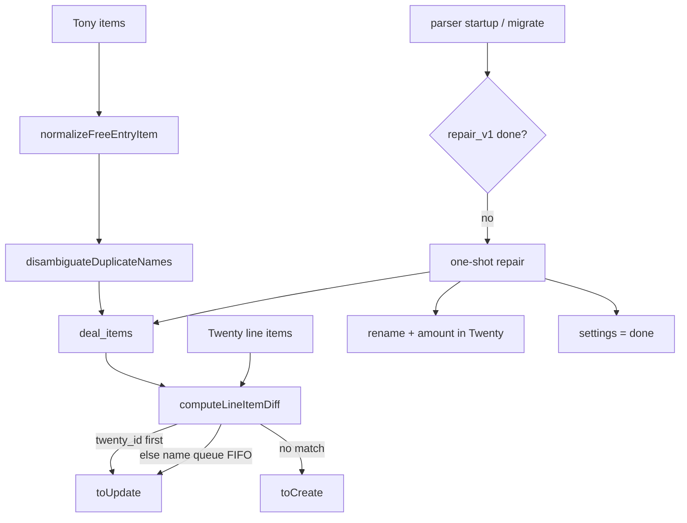

# Free-entry дубликаты: match по twenty_id + one-shot repair — Design Spec

**Дата:** 2026-08-04  
**Статус:** Draft (ожидает review)  
**Репозиторий:** `crmparserv2` (основной); UI rename в BrandingTwentyView уже есть и не меняется в v1  
**Связанные спеки:**  
`2026-07-28-tony-free-entry-name-design.md`,  
`2026-06-20-twenty-line-items-design.md`,  
`2026-06-27-line-item-stage-protection-design.md`,  
`2026-07-29-amount-lock-and-selective-resync-design.md`

## Проблема

1. В Tony часто ≥2 позиций **«БРЕНДИНГ свободная запись…»** с разными комментариями.
2. `computeLineItemDiff` и `buildOverrideMap` ключуют **только по имени** → оба update попадают в один `twenty_id`; вторая строка в Twenty — сирота; локально две строки могут получить один `twenty_id`.
3. Ручная сумма позиции (`amount_locked`) + Σ eligible → `opportunity.amount` **удваивается**, если две локальные строки делят один `twenty_id`.

Пример: opportunity `1f7021a5-15e4-42f8-9987-1224e86cf54c` — две шаблонные free-entry в Twenty; `amount` сделки 20 000 при вводе 10 000 на одну позицию.

Частично уже сделано: `normalizeFreeEntryItem` (имя = комментарий) в `buildTonyItems`. Этого недостаточно без уникализации имён и match по `twenty_id`.

## Цели

1. **Предотвратить** схлопывание дублей на каждом parse/sync:
   - free-entry имя = комментарий (как сейчас);
   - одинаковые имена после нормализации → суффиксы ` (#2)`, ` (#3)`, …;
   - diff: сначала `twenty_id`, иначе очередь по имени (не last-wins Map);
   - override map: не вешать один `twenty_id` на две строки с одним именем.
2. **Одноразовый repair** при старте парсера: починить уже созданные сделки в SQLite и Twenty (rename, развести id, пересчитать amount).
3. Unit-тесты на disambiguate, diff, override map, ключевые шаги repair.

## Нецели (v1)

- Стабильный Tony row `data-id` как первичный ключ.
- Кнопка/UI «запустить repair» (только авто one-shot).
- Изменение stage-protection правил для полей Tony (кроме явного rename имени при repair).
- Миграция исторических Excel-экспортов.
- Изменение BrandingTwentyView automation `planBrandingFreeNameRename` (уже корректна для UI).

---

## Decisions Summary

| Тема | Решение |
|------|---------|
| Постоянный фикс | Approach A: twenty_id-first match + free-entry + disambiguator |
| Одинаковый комментарий | Суффиксы ` (#2)`, ` (#3)` … (первая без суффикса) |
| Override map | Ключ по вхождению имени (`name#0`, `name#1`, …), не last-wins |
| Repair trigger | Авто при старте/миграции, один раз |
| Repair scope | Локально + Twenty (rename, развести id, amount) |
| Флаг | `settings.free_entry_duplicate_repair_v1 = 'done'` только после успешного полного прохода |
| Hard fail (сеть/auth) | Флаг **не** ставить → retry на следующем старте |
| Soft fail (одна сделка) | Лог + continue; не блокирует `done`, если проход завершён |

---

## Архитектура

---

## Постоянное поведение

### 1. `disambiguateDuplicateNames(items)` (`tony-mapping.js`)

Вход: массив items **после** `normalizeFreeEntryItem` (уже с именами = комментарий для free-entry).

Правило: среди items с одинаковым `normalizePattern(name)` (или exact name — **фиксируем exact trimmed name** для суффикса, чтобы UI был читаемым):

| Порядок | Имя |
|---------|-----|
| 1-е вхождение | без изменений |
| 2-е | `{name} (#2)` |
| 3-е | `{name} (#3)` |

Применяется внутри `buildTonyItems` после map `normalizeFreeEntryItem`.

Не применяется к сырому `parseTonyOrder` / `tonyContentHash` (hash остаётся по сырому Tony снимку).

### 2. `buildOverrideMap` / `replaceDealItemsPreservingOverrides` (`deal-items-update.js`)

Сейчас: `map[item.name] = { twenty_id, … }` — last-wins.

Новое:

- При построении map из existing: для каждого имени вести счётчик вхождения → ключ `` `${name}#${i}` ``.
- При restore на новые classified items: идти в том же порядке имён, брать `` `${name}#${i}` ``.
- Итог: две строки с одним каталожным/нормализованным именем сохраняют **разные** `twenty_id`, если они были разными; не получают один id на двоих.

Если existing уже битый (два row с одним `twenty_id`) — one-shot repair чинит до/на старте; повседневный путь не обязан лечить историю.

### 3. `computeLineItemDiff` (`twenty-line-items-sync.js`)

Для **parsed** items (не manual Twenty):

1. Если `item.twenty_id` и такой id есть в `existingLineItems` → `toUpdate` на этот id (с учётом stage protection).
2. Иначе: взять следующую свободную строку из очереди `Map<normalizedName, lineItem[]>` (FIFO по existing с этим именем, ещё не занятые update/manual).
3. Если очереди нет → `toCreate`.

Для delete: existing, чей id не попал в toUpdate/manual и чьё имя **не** покрыто оставшимися unmatched parsed names по очереди — delete если не protected; иначе preserve.

`ignoreStageProtection` / manual Twenty path — без изменений по смыслу (manual уже по `twenty_id`).

### 4. Sync update payload

При update по `twenty_id` после free-entry normalize: `name` в Twenty обновляется на новое (comment / disambiguated), `kommentariy` пустой — как в free-entry спеке. Stage-protection: если stage protected, **не** обновлять поля из Tony (как сейчас) — имя тогда чинит one-shot/UI, не обычный sync.

**Уточнение:** one-shot repair **может** переименовать даже protected stage (явное исключение: только поле `name` (+ очистка comment), не price/qty).

---

## One-shot repair

### Триггер

После `migrate()` / при boot сервера (точка рядом с существующим startup): если `settings.free_entry_duplicate_repair_v1 !== 'done'` → запустить job (async или sync с логом; не блокировать HTTP дольше разумного — **предпочтительно background после listen**, с флагом `running` чтобы не дублировать).

Рекомендуемая схема флагов:

| value | Смысл |
|-------|--------|
| (absent) | ещё не запускали |
| `running` | в процессе (crash → следующий старт видит stale running) |
| `done` | успешно завершён |
| `failed` | hard fail; можно retry |

**Stale `running`:** если старше N часов (например 6) при старте — считать failed и retry.

### Алгоритм на сделку (`twenty_id IS NOT NULL`)

1. Загрузить Twenty line items (`id, name, stage, kommentariy, amount, istochnik`).
2. Загрузить локальные `deal_items`.
3. **Rename в Twenty:** для LI с именем free-entry template и непустым `kommentariy` → `name = firstLine(comment)`, `kommentariy = ''` (как `planBrandingFreeNameRename` / `normalizeFreeEntryItem`).
4. **Disambiguate в Twenty:** среди LI с одинаковым name после шага 3 — выставить ` (#2)`… через update (порядок: `createdAt` asc или текущий list order).
5. **Локально развести `twenty_id`:** если несколько `deal_items` с одним `twenty_id` → оставить id на одной строке (предпочтительно с `amount_locked` или первой); остальным сбросить `twenty_id` и по возможности привязать к сиротам Twenty с тем же/новым именем без локальной связи.
6. **Пересчитать** `opportunity.amount` = Σ eligible локальных totals (с учётом `amount_locked`) и `updateOpportunity`.
7. Soft error на одной сделке → log `repair.deal_failed`, continue.
8. Hard error (Twenty auth/unreachable) → abort job, `failed`, не `done`.

Критерий «нужна ли сделка»: есть ≥1 free-entry template name в Twenty/local **или** дубликаты `twenty_id` в local **или** ≥2 LI с одинаковым normalize(name). Иначе skip.

### Идемпотентность

Повторный прогон после `done` — no-op.  
Повтор до `done` безопасен: rename уже переименованных (не template) пропускается; disambiguate не добавляет второй `(#2)` к уже суффиксному имени (детект: имя уже оканчивается на ` (#N)`).

---

## Ошибки и края

| Случай | Поведение |
|--------|-----------|
| Protected stage + rename в repair | разрешено (только name/comment) |
| Protected orphan delete | не удалять; preserve |
| Amount lock при разведении id | lock остаётся на строке, где был |
| Сделка без коллизий | skip |
| Twenty down на старте | `failed`, retry next boot |
| Две free-entry с одинаковым comment | `Name` и `Name (#2)` |

---

## Тестирование

| Кейс | Ожидание |
|------|----------|
| `disambiguateDuplicateNames(['A','A','B'])` | `A`, `A (#2)`, `B` |
| Diff: два item с разными `twenty_id` | два `toUpdate` на разные id |
| Diff: два item без id, одно имя, два existing | FIFO: каждый existing по одному update, не оба в один |
| Diff: два item без id, одно имя, один existing | один update + один create |
| Override map: два existing same name, разные twenty_id | после replace оба id сохранены на соответствующих новых row |
| Repair rename | template + comment → name=comment |
| Repair shared twenty_id | после — уникальные связи / сирота привязана |
| Opportunity amount после lock + двух row | не double-count один twenty_id |

---

## Связь с уже существующим

- `2026-07-28-tony-free-entry-name`: остаётся в силе; эта спека **дополняет** disambiguator + identity + repair.
- Stage protection: sync по-прежнему не трогает protected поля из Tony; repair — узкое исключение на rename.
- Amount lock: формула opportunity без изменений; чинится вход (нет двух row с одним twenty_id).

---

## Out of scope follow-ups

- Admin HTTP endpoint для ручного re-run repair.
- TTL/метрики коллизий имён в parse log.
- Привязка к Tony DOM `data-id`.
