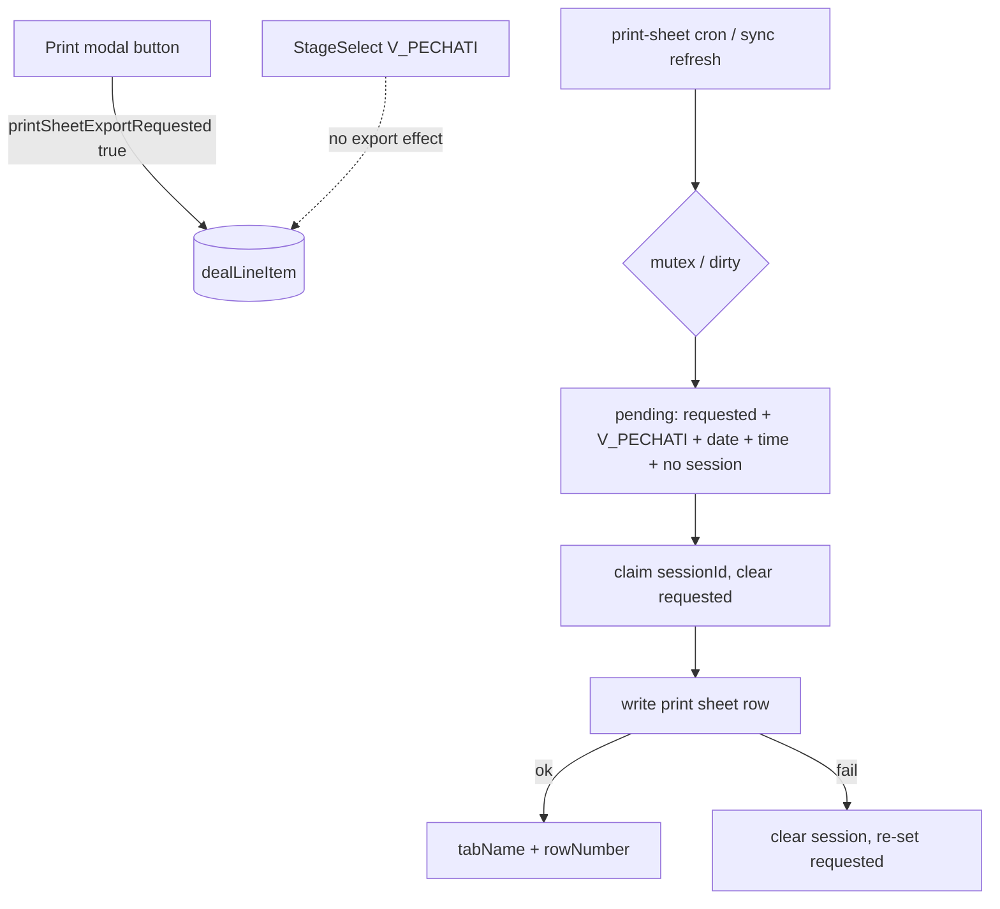

# Print sheet: anti-dupe + explicit send button — Design Spec

**Date:** 2026-08-05  
**Status:** Approved for planning  
**Repos:** `crmparserv2` (export cycle), `BrandingTwentyView` (print modal UI)  
**Related:** `2026-06-28-print-sheet-export-design.md`

## Problem

1. **Duplicate rows** in the Google print sheet for one Twenty position (observed: three copies). Prod logs show overlapping `runPrintSheetCycle` runs (cron every minute + post-sync refresh) with no mutex; export is write-then-mark (`printSheetSessionId` set only after Sheets write), so two cycles can both treat the same pending item as exportable.
2. **Accidental / unclear trigger:** filling date/time while stage is «В печати» (or setting that stage) auto-queues the row. Operators need an explicit «Отправить в печать» action; stage «В печати» must remain independently settable and **must not** enqueue the sheet.

## Goals

- Eliminate concurrent-cycle duplicate exports (mutex + claim-before-write).
- Export only when the operator presses **Отправить в печать** in the print modal.
- Keep StageSelect able to set/leave `V_PECHATI` without side-effect on Sheets.
- Keep session clear on leave `V_PECHATI` so a later send can create a new sheet row (reprint).
- Log cycle results from cron, not only from sync refresh.

## Non-Goals

- Cleaning existing duplicate rows already in Google Sheets.
- Freza queue / Freza modal send button.
- Dedicated «Отправить повторно» control (reprint = clear session by leaving `V_PECHATI`, then press send again — or press send after session was cleared).
- Changing Sheets column mapping or read-back fields.

---

## Decisions

| Question | Decision |
|----------|----------|
| Stage `V_PECHATI` | Remains in StageSelect; **not** an export trigger |
| Export trigger | New boolean `printSheetExportRequested` set only by modal button |
| Pending query | `printSheetExportRequested=true` AND `stage=V_PECHATI` AND date+time set AND `printSheetSessionId` null/empty |
| Why stage still in pending? | Session clear is `stage ≠ V_PECHATI` → clear. Exporting outside `V_PECHATI` would be wiped next cycle. Stage is a **gate** for a sticky session, **not** the trigger. |
| Stage alone | Setting `V_PECHATI` without the button does **not** export |
| Claim order | Set session claim **before** Sheets write; on Sheets failure roll back claim |
| Concurrent cycles | Process-local mutex + dirty re-run flag |
| After successful claim | Set `printSheetExportRequested=false` so a later button press can request again |
| Button changes stage? | **No** — if stage ≠ `V_PECHATI`, button still sets `requested=true`; export waits until stage is `V_PECHATI` |

---

## Twenty metadata

| Field | Type | Purpose |
|-------|------|---------|
| `printSheetExportRequested` | BOOLEAN | Operator requested sheet export; cleared after successful claim |

Create via Twenty MCP / app field on `dealLineItem`. Default `false`. Hide from default operator views if noisy (internal + modal).

Existing fields unchanged: `printSheetSessionId`, `printSheetTabName`, `printSheetRowNumber`, `dataGotovnostiPechati`, `vremyaGotovnostiPechati`.

---

## Export / session flow

```
Operator fills date + time in print modal
  → (no sheet export)

Operator may set stage V_PECHATI via StageSelect
  → (no sheet export)

Operator clicks «Отправить в печать»
  → printSheetExportRequested = true

Cron / refresh cycle (single-flight):
  pending = exportRequested AND stage=V_PECHATI AND date AND time AND sessionId empty
  → claim: printSheetSessionId = UUID; printSheetExportRequested = false
  → write Sheets row
  → patch tabName + rowNumber
  → on Sheets error after claim: clear session + printSheetExportRequested = true (retry)

Position leaves V_PECHATI:
  → clear printSheetSessionId, tabName, rowNumber
  → operator must click send again for a new sheet row (reprint)
```

### Claim-before-write detail

1. Update Twenty: `{ printSheetSessionId: <uuid>, printSheetExportRequested: false }` (claim).
2. `writePrintSheetRow(...)`.
3. On success: update `{ printSheetTabName, printSheetRowNumber }`.
4. On Sheets failure: update `{ printSheetSessionId: null, printSheetTabName: null, printSheetRowNumber: null, printSheetExportRequested: true }` so the position stays requested without a sheet row.

Empty-string session ids (legacy clears) must be treated as «no session» in pending filters and clear logic (normalize `null` / `''`).

### Mutex

Module-level lock around `runPrintSheetCycle`:

- If a run is in progress, set `dirty = true` and return immediately.
- When the run finishes, if `dirty`, clear dirty and run once more.

Applies to cron and `refreshPrintSheetAfterSync` / `runPrintSheetRefresh`.

### Logging

Every completed cycle logs `{ exported, readbackUpdated, sessionsCleared }` (cron path included).

---

## UI (BrandingTwentyView)

`SheetQueuePanel` (print only via prop, e.g. `enableSendToPrint`):

| State | Control |
|-------|---------|
| Missing date or time | Button disabled; hint to fill date/time |
| Ready (date+time), no session, not requested | Primary «Отправить в печать» → `printSheetExportRequested: true` |
| Requested, stage ≠ `V_PECHATI` | Disabled; «Поставь стадию «В печати» — уйдёт в таблицу» |
| Requested, stage = `V_PECHATI`, no session yet | Disabled; «Уходит в таблицу…» |
| Session present | Disabled; «В очереди печати» |

- Do **not** change `stage` on button click.
- Freza panel: no send button (`enableSendToPrint` unset).
- Update copy: remove «уйдёт в таблицу при стадии В печати»; explain button + stage gate.

StageSelect: **unchanged** options including `V_PECHATI`.

---

## Architecture



---

## Testing

**crmparserv2**

- Mutex: overlapping calls → one execution (+ optional dirty re-run).
- Claim-before-write: session set before write mock; Sheets throw → session cleared and `printSheetExportRequested` true again.
- Pending filter requires `printSheetExportRequested` **and** `stage === V_PECHATI` (stage alone is insufficient).
- Session clear still when active session and `stage !== V_PECHATI`.

**BrandingTwentyView**

- Button disabled without date/time.
- Click patches `{ printSheetExportRequested: true }` only.
- Freza chip does not show send button.

---

## Rollout

1. Add Twenty field `printSheetExportRequested`.
2. Deploy crmparser (mutex + claim + new pending filter) — until UI is live, **no new auto-exports** from stage alone (intentional break of old path).
3. Deploy TwentyView app with send button.
4. Operators use button for all new print-queue rows.

Migration note: positions already in `V_PECHATI` with date/time but never exported under the old path will **not** auto-export after deploy; they need one button press.
